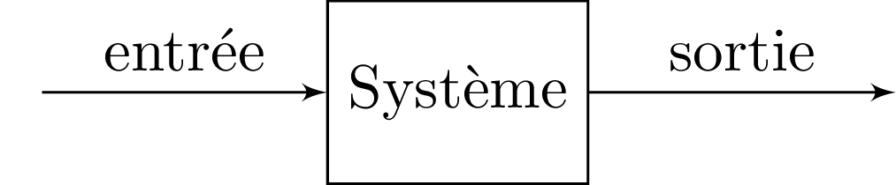
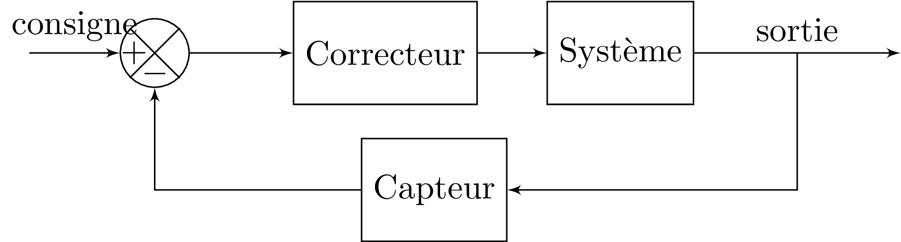

# Introduction

L'**asservissement**, également connu sous le terme de contrôle automatique, est une discipline fondamentale en ingénierie qui se concentre sur la régulation et le contrôle des processus et des systèmes dynamiques. Cette discipline est essentielle pour garantir que les systèmes fonctionnent de manière précise et stable, malgré les perturbations et les variations des conditions opérationnelles.

Les systèmes d'asservissement sont omniprésents dans notre vie quotidienne et industrielle. Ils jouent un rôle crucial dans une multitude de domaines, tels que :

* L'automobile : Les systèmes de contrôle de la stabilité et les régulateurs de vitesse.
* L'industrie manufacturière : Le contrôle des machines-outils et des processus de fabrication.
* L'aéronautique et l'aérospatiale : Le pilotage automatique des avions et le contrôle des satellites.
* L'énergie : La régulation des centrales électriques et la gestion des réseaux de distribution d'énergie.

## Problématique

Dans ce cours, nous allons nous focaliser sur le contrôle et la commande des systèmes à une entrée / une sortie (SISO: Single Input Single Output).

Un système SISO peut être représenté un bloc prenant une entrée et renvoyant une sortie. 

<figure>
    
    <figcaption>Système SISO: Modélisation Schéma Bloc</figcaption>
</figure>

### Elaboration d'un signal de commande

En asservissement, notre objectif est d'envoyer un **signal de commande** à l'entrée d'un système de manière à ce que la sortie du processus suive "au mieux" un signal de **consigne**. 

Pour atteindre cet objectif, une stratégie possible consiste à :

* mesurer la sortie du système au moyen d'un **capteur**,
* mesurer la différence entre la consigne et la sortie du capteur au moyen d'un **comparateur**,
* élaborer un signal de commande à partir de la sortie du comparateur.

Cette structure correspond à un système en **boucle fermée** puisque la sortie est combinée avec le signal d'entrée.

<figure>
    
    <figcaption>Système Bouclé</figcaption>
</figure>

### Exemple de la régulation de vitesse

Considérons la problématique de régulation de la vitesse d'une voiture. Pour maintenir une vitesse constante égale à la limite de vitesse (par exemple, 130 km/h), nous utilisons naturellement une stratégie de correction en boucle fermée. En effet, notre cerveau conserve en mémoire la vitesse de consigne et la compare avec la vitesse réelle indiquée par le capteur de vitesse. En fonction de la différence entre ces deux vitesses, notre cerveau élabore un signal de commande qui se traduit par une modification de la pression de notre pied sur la pédale d'accélération.

## Signaux de référence

En asservissement, l'utilisation de signaux de référence à l'entrée du système est essentielle pour analyser et caractériser le comportement du système. Cette partie présente les signaux de tests les plus classiques.

### Modèle de signaux

#### 1. Impulsion de Dirac

$$
\delta(t) = \begin{cases}
\infty & \text{si } t = 0 \\
0 & \text{si } t \ne 0
\end{cases} \quad \text{et} \quad \int_{-\infty}^{\infty} \delta(t) \, dt = 1
$$

- **Description** : L'impulsion de Dirac est une fonction idéale qui est infiniment grande à $t = 0$ et nulle ailleurs, avec une intégrale sur tout l'intervalle qui vaut 1.
- **Utilisation** : L'utilisation de l'impulsion permet de déterminer la **réponse impulsionnelle** d'un système,caractéristique fondamentale permettant de décrire complètement le comportement du système à toute entrée.

#### 2. Signal échelon (ou fonction de Heaviside)

$$
  u(t) = \begin{cases}
  0 & \text{si } t < 0 \\
  1 & \text{si } t \geq 0
  \end{cases}
$$
- **Description** : Le signal échelon est une fonction qui passe de 0 à 1 à un instant précis (généralement \( t = 0 \)). C'est le signal le plus couramment utilisé pour tester la réponse d'un système en régime transitoire et en régime permanent.
- **Utilisation** : L'utilisation de l'échelon permet de déterminer la **réponse indicielle** d'un système, réponse permettant d'évaluer la stabilité, la précision d'un système et la dynamique d'un système.

#### 3. Rampe
 
$$
  r(t) = \begin{cases}
  0 & \text{si } t < 0 \\
  t & \text{si } t \ge 0
  \end{cases}
$$
- **Description** : La rampe est une fonction qui augmente linéairement avec le temps.
- **Utilisation** :  L'utilisation de la rampe permet d'analyser la capacité du système à suivre une pente constante. Elle utile pour étudier le comportement des systèmes en régime transitoire et la précision.

#### 4. Signal sinusoïdal

$$
  x(t) = A \cos(\omega_0 t + \phi)
$$
  où $A$ est l'amplitude, $\omega_0$ est la pulsation angulaire, et $\phi$ est la phase.
- **Description** : Le signal sinusoïdal est un signal périodique de période $T_0=1/f_0$ avec $f_0=\omega_0/(2\pi)$.
- **Utilisation** : L'utilisation de la sinusoide permet d'analyser la **réponse fréquentielle** d'un système, c'est-à-dire comment le système réagit à différentes fréquences d'entrée.

### Illustrations

<figure>
    
    <figcaption>Signaux tests pour la caractérisation des systèmes</figcaption>
</figure>

## Critère de Performance

Pour évaluer les performances d'un système, une approche possible consiste à analyser la réponse indicielle. A titre d'illustration, la courbe suivante présente l'allure de la réponse d'un système à une entrée de type échelon d'amplitude $E$ (réponse indicielle) c-à-d $x(t)=Eu(t)$. A partir de cette réponse, nous pouvons évaluer plusieurs critères permettant de critiquer les performances d'un système.

<figure>
    
    <figcaption>Réponse Indicielle d'un système</figcaption>
</figure>

### 1. Stabilité

La première chose à évaluer est la stabilité du système. Un système est dit stable, au sens BIBO (Bounded Input Bounded Output), si et seulement si pour tout $t$ 

$$|x(t)|<\infty ~\Rightarrow~|y(t)|<\infty$$

En d'autres termes, une entrée bornée doit conduire à une sortie bornée.

### 2. Précision

Une autre caractéristique importante d'un asservissement est sa précision. Pour mesurer la précision, un critère possible consiste à mesurer l'écart entre l'entrée et la sortie en régime permanent c-à-d lorsque la sortie s'est stabilisée vers une valeur finie. La sortie en régime permanent est également appelée **valeur finale** :

$$V_f = \lim_{t\to \infty} y(t) = y(\infty)$$

L'écart en régime permanent est donné par $\epsilon(\infty)=\lim_{t\to \infty} \epsilon(t)$ où $\epsilon(t)= x(t)-y(t)$ correspond à l'écart instantané.

En pratique, nous préférons utiliser l'écart statique relatif qui est une mesure généralement indépendante de l'amplitude de l'entrée. L'écart statique relatif est défini par :

$$\epsilon_r (\%) = 100 \times \left(\frac{x(\infty)-y(\infty)}{x(\infty)}\right)$$

Un système précis présente un écart statique relatif nul.

### 3. Rapidité

En plus du comportement statique, il est souvent important de critiquer le comportement dynamique du système. Pour critiquer  le comportement dynamique, il est courant d'analyser la rapidité du système via sa réponse indicielle. Pour mesurer la rapidité, un critère possible est le temps de réponse à $\pm 5\%$.

Le temps de réponse à $\pm 5\%$ est défini par :

$$t_r = \min_{t}\{t: \forall \tau >t,~0.95 y(\infty) \le y(\tau) \le 1.05 y(\infty)\}$$

En d'autres termes, le temps de réponse correspond au temps nécessaire pour rentrer **définitivement** dans une fourchette comprise entre $-5\%$ et $+5\%$ de la valeur finale. Plus un système est rapide, plus son temps de réponse est faible.

### 4. Dépassement

Une autre caractéristique importante concerne la présence ou nom d'oscillation au niveau de la réponse indicielle.
Pour quantifier les oscillations, une critère possible consiste à mesurer le premier dépassement $D = \max[y(t)]-y(\infty)$. Le plus souvent, nous préférons utiliser la valeur du premier dépassement 
relatif qui est une mesure généralement indépendante de la valeur finale. 

Le premier dépassement relatif est défini par 

$$D_r(\%)=100 \times \frac{\max[y(t)]-y(\infty)}{y(\infty)}$$

### 5. Robustesse

Le plus souvent, l'analyse d'un système est réalisé sous l'hypothèse que nous connaissons exactement les comportements des différents blocs. Le plus souvent, ces comportements sont modélisés par des équations différentielles ou par des équations aux différences.  Cette modélisation est, dans le meilleur des cas, une approximation de la réalité. Dans un contexte plus réaliste, il est important d'évaluer la robustesse des stratégies de commande en présence d'écart de modélisation.

Pour mesure la robustesse d'un asservissement, une approche couramment utilisée consiste à analyser l'influence de perturbations extérieures sur le comportement du système. 
