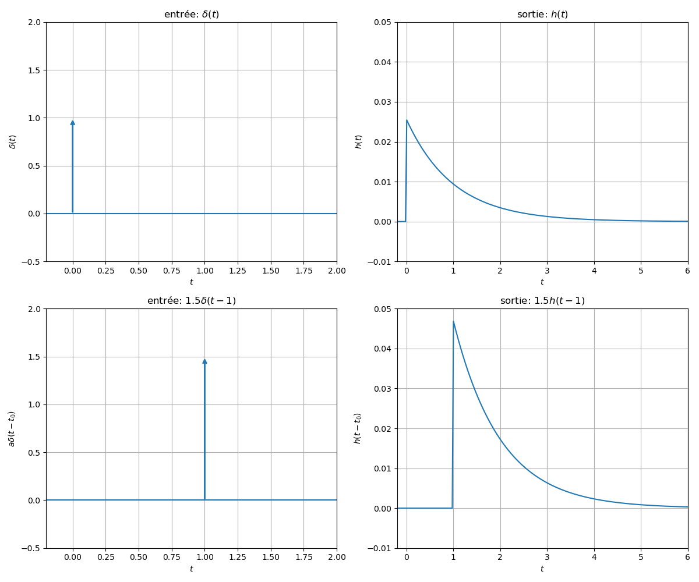

# Contexte & Hypothèses

## Contexte

Soit un système SISO ayant pour entrée un signal $x(t)$ et pour sortie un signal $y(t)$. 

<figure>
    
    <figcaption>Système SISO </figcaption>
</figure>

Dans ce cours, nous allons nous restreindre à l'analyse des systèmes dit linéaires et invariants dans le temps (SLIT).

## Hypothèses 

Considérons un système SISO $\mathcal{M}$ tel que la relation d'entrée sortie soit donnée par :  

$$y(t)=\mathcal{M}(x(t))$$

Dans ce cours, nous allons considérer que ce système est **linéaire et invariant dans le temps** (SLIT)

### Définition

Un système est dit linéaire et invariant dans le temps (SLIT), si il respecte les 2 propriétés suivantes.

#### 1. Linéarité

Considérons une entrée composée de la superposition de deux signaux: $\alpha_1 x_1(t) + \alpha_2 x_2(t)$. La propriété de linéarité implique que la sortie s'exprime mathématiquement sous la forme:

$$\mathcal{M}(x(t))=\alpha_1 \mathcal{M}(x_1(t)) + \alpha_2 \mathcal{M}(x_2(t))$$

En d'autres termes, si l'entrée est une combinaison linéaire de signaux, la sortie est donnée par la même combinaison linéaire des réponses correspondantes. Cette propriété est également appelée **principe de superposition**

#### 2. Invariance dans le temps

Considérons que l'entrée d'un système SLIT est notée $x(t)$ et que sa sortie est notée $y(t)=\mathcal{M}(x(t))$.

Lorsque l'entrée du système SLIT est $x(t-\tau)$, la propriété d'invariance dans le temps implique que

$$\mathcal{M}(x(t-\tau))=y(t-\tau)$$

En d'autres termes, les caractéristiques du système ne changent pas avec le temps.

### Illustration

La figure suivante illustre ces 2 propriétés. Les sous-figures du haut présentent la réponse impulsionnelle du système. Les sous-figures du bas présentent la réponse temporelle du système lorsque l'entrée est une impulsion pondérée et décalée dans le temps. Pour un SLIT, la sortie du système pour une impulsion pondérée et décalée dans le temps s'obtient en pondérant et en décalant dans le temps la réponse impulsionnelle.

<figure>
    
    <figcaption>Illustration des propriétés d'un système SLIT. </figcaption>
</figure>
