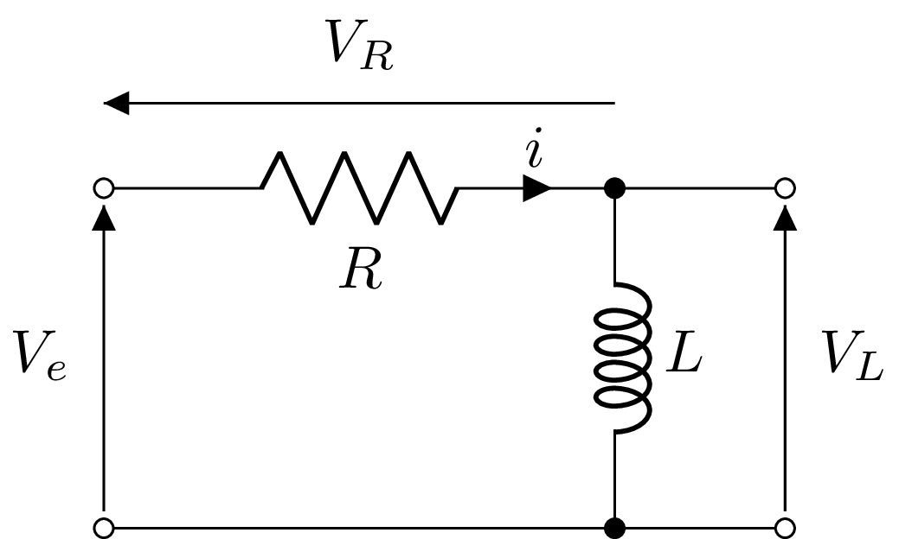

# Analyse des Systèmes Linéaires et Invariants dans le Temps

## Modélisation

De nombreux systèmes SISO SLIT peuvent se modéliser sous la forme d'une équation différentielle linéaire à coefficients constants. Une équation différentielle linéaire à coefficients constants est un type spécifique d'équation différentielle ordinaire (ODE) où la fonction inconnue et ses dérivées apparaissent de manière linéaire, et les coefficients de ces termes sont des constantes.

L'expression générale d'une équation différentielle linéaire à coefficients constants est donnée par :
$$
a_n \frac{d^n y(t)}{dt^n} + \cdots + a_1 \frac{dy(t)}{dt} + a_0 y(t) = b_m \frac{d^m x(t)}{dt^m}  + \cdots + b_1 \frac{dx(t)}{dt} + b_0 x(t)$$

où :
* $y(t)$ est la sortie du système,
* $e(t)$ est l'entrée du système,
* $a_0, a_1, \ldots, a_n$ sont des coefficients constants associés aux dérivées de la sortie $y(t)$,
* $b_0, b_1, \ldots, b_m$ sont des coefficients constants associés aux dérivées de l'entrée $x(t)$,
* $n\ge m$ est l'ordre de l'équation différentielle

Si le membre de droite de l'équation est nul (c-à-d $b_0=b_1=...=b_m=0$), alors l'équation est dite **homogène**; sinon, l'équation est dite **non-homogène**.

::: details exemple: circuit RL

Considérons le circuit RL suivant :

<figure>
    
    <figcaption>Circuit RL </figcaption>
</figure>

Pour ce circuit, la relation entre la tension d'entrée $v_e(t)$ et le courant $i(t)$ est donnée par l'équation différentielle :

$$L\frac{di(t)}{dt} + Ri(t) = v_e(t)$$

:::

## Réponse du système à une entrée quelconque

Toute fonction d'entrée $x(t)$ peut être décomposée comme une somme d'impulsion de Dirac décalées dans le temps :

$$x(t) = \int_{-\infty}^{\infty} x(\tau) \delta(t - \tau) \, d\tau $$

où $\delta(t - \tau)$ est la fonction delta de Dirac centrée en $\tau$. 

En utilisant cette décomposition et les propriétés des SLIT, il est possible d'obtenir la réponse temporelle d'un système de réponse impulsionnelle $h(t)$ à une entrée quelconque.

### Produit de convolution

Notons $h(t)$ la **réponse impulsionnelle** du système SLIT, c'est-à-dire la réponse du système à une entrée $\delta(t)$.
Comme le système est invariant dans le temps, la sortie du système pour une entrée $\delta(t - \tau)$ est $h(t - \tau)$.

Si l'entrée est une somme pondérée de deltas décalés, la sortie est la même somme pondérée des réponses impulsionnelles décalées. En utilisant la décomposition de $x(t)$, la sortie $y(t)$ s'exprime alors sous la forme :

$$y(t) = \mathcal{M}(x(t)) = (x * h)(t) = \int_{-\infty}^{\infty} x(\tau) h(t - \tau) \, d\tau$$

où $(x * h)(t)$ correspond au **produit de convolution** entre $x(t)$ et $h(t)$. La variable $\tau$ est la variable muette du produit (elle n'apparaît plus dans le résultat).

::: details Démonstration
Notons $L$, l'opérateur permettant de décrire le comportement du système et $\delta_u(t)$ une impulsion retardée de $u$ s.

En décomposant l'entrée du système sous la forme

$$x(t) = \int_{-\infty}^{\infty} x(u) \delta_u(t) du $$

et en imposant la continuité et la linéarité de $L$, nous obtenons

$$
L x(t) = \int_{-\infty}^{\infty} x(u) L\delta_u(t) du
$$
En notant $h(t)=L\delta(t)$ la réponse impulsionnelle du système et en utilisant la propriété d'invariance en temps, il en vient que

$$
L x(t) = \int_{-\infty}^{\infty} x(u) h(t-u) du= \int_{-\infty}^{\infty} h(u) x(t-u) du =  (x * h)(t) 
$$

:::

Le produit de convolution présente plusieurs propriétés qui seront exposées explicitement dans le cours de traitement du signal.

::: details Propriétés

* 1. Commutativité :
$$(x * h)(t) = (h * x)(t)$$

Cette propriété indique que l'ordre des fonctions dans le produit de convolution n'affecte pas le résultat.

* 2. Associativité
$$ (x * (h * g))(t) = ((x * h) * g)(t)$$

Cette propriété permet de regrouper les convolutions sans affecter le résultat final, facilitant ainsi le calcul de convolutions successives.

* 3. Distributivité
$$ x * (h + g) = (x * h) + (x * g)$$
La convolution d'une fonction avec une somme de deux fonctions est égale à la somme des convolutions de la fonction avec chacune des deux fonctions.

* 4. Invariance par translation
$$(x(t - t_0) * h(t))(t) = (x * h)(t - t_0)$$
Cette propriété indique que décaler une des fonctions d'entrée dans le temps décale également la sortie de la même quantité.

* 5. Produit de convolution avec une delta de Dirac
$$(x * \delta)(t) = x(t)$$
La convolution d'une fonction $x(t)$ avec une fonction delta de Dirac $\delta(t)$ reproduit la fonction $x(t)$ elle-même.

* 6. Produit de convolution avec une constante
$$c * x(t) = c x(t)$$
La convolution d'une fonction avec une constante est simplement la fonction multipliée par cette constante.

:::

### Causalité

Un système LTI est causal si la sortie du système à un instant donné dépend uniquement des valeurs présentes et passées de l'entrée, et non des valeurs futures.  Par rapport à la réponse impulsionnelle $h(t)$ du système, cela impliue que :

$$h(t) = 0 \quad \text{pour tout} \quad t < 0.$$

Autrement dit, $h(t)$ doit être une fonction causale, nulle pour $t < 0$. Cela assure que la sortie $y(t)$ dépend uniquement des valeurs de $x(t)$ pour $\tau \leq t$.

### Stabilité 

Un système linéaire et invariant dans le temps (LTI) est stable si et seulement si, pour toute entrée bornée, la sortie est également bornée. Par rapport à la réponse impulsionnelle $h(t)$ du système, cela implique que :

$$\int_{-\infty}^{\infty} |h(t)| \, dt < \infty.$$

::: details Exemple: réponse indicielle d'un premier ordre

Considérons un système de premier ordre de gain statique unitaire et de constante de temps unitaire. Il est possible d'établir que la réponse impulsionnelle de ce système est donnée par 

$$h(t) = e^{-t} \text{ pour } t \geq 0$$

Comme $h(t)=0$ pour $t < 0$, ce système est causal. De plus, ce système est stable car 
$$
\int_{-\infty}^{\infty} |h(t)| \, dt = \int_{0}^{\infty} e^{-t} dt = \left. -e^{-t} \right|_{0}^{\infty}= 0 - (-1) = 1 < \infty
$$

Si l'entrée est un signal échelon unitaire $u(t)$, nous pouvons déterminer la réponse indicielle du système en utilisant un produit de convolution. Mathématiquement, 

$$y(t) = (u * h)(t) = \int_{-\infty}^{\infty} u(\tau) h(t - \tau) d\tau$$

En substituant $u(\tau) = 1$ pour $\tau \ge 0$ et $h(t - \tau) = e^{-(t - \tau)}$, nous trouvons:

$$
\begin{align}
y(t) &= \int_{0}^{t} 1 \cdot e^{-(t - \tau)} d\tau\\
y(t) &= e^{-t} \int_{0}^{t} e^{\tau} d\tau\\
y(t) &= e^{-t} \left[ e^{\tau} \right]_{0}^{t}\\
y(t) &= 1 - e^{-t}
\end{align}
$$

:::

### Simulation Numérique

Il est possible d'obtenir simplement la réponse indicielle du système en utilisant python et le module `control`.

<<< @/content/course/src/step.py

<figure>
    
    <figcaption>Réponse indicielle d'un système de premier ordre. </figcaption>
</figure>

## Réponse Fréquentielle

Les systèmes SLIT vont avoir un comportement singulier sur les signaux d'entrée composés d'exponentielles complexes. Ce comportement motive l'utilisation d'une représentation spécifique nommée **réponse fréquentielle**.

### Cas des exponentielles complexes

Un signal exponentiel complexe de pulsation $\omega_0$ s'exprime mathématiquement sous la forme :
$$x(t)=e^{j\omega_0 t}$$
Ce signal est periodique de période $T_0=\frac{2\pi}{\omega_0}$. Lorsque le signal d'entrée est une exponentielle complexe de pulsation $\omega_0$, la sortie s'exprime sous la forme :

$$
y(t)= H(j\omega_0)e^{j\omega_0 t}
$$
où
$$H(j\omega_0)=\int_{-\infty}^{\infty} h(t) e^{-j\omega_0 t}dt$$
correspond à la transformée de Fourier de la réponse impulsionnelle. 

::: details Démonstration
En utilisant la définition et la propriété de commutativité du produit de convolution, nous obtenons :
$$
\begin{align}
y(t) &= (x * h)(t)\\
&=(h * x)(t)\\
&=\int_{-\infty}^{\infty} h(\tau) e^{j\omega_0 (t-\tau)}d\tau\\
&=e^{j\omega_0 t} \int_{-\infty}^{\infty} h(\tau) e^{-j\omega_0 \tau}d\tau\\
&= H(j\omega_0)e^{j\omega_0 t}
\end{align}
:::

En d'autres termes, le système SLIT va uniquement multiplier l'exponentielle complexe en entrée par une constante qui ne dépend pas du temps. La réponse fréquentielle est généralement complexe et il est courant d'utiliser une représentation conjointe du module, $|H(j\omega)|$, et de l'argument, $\arg[H(j\omega)]$, en fonction de $\omega$.

::: details Exemple : réponse fréquentielle d'un premier ordre

Considérons un système de premier ordre de gain statique unitaire et de constante de temps unitaire. La réponse impulsionnelle de ce système est donnée par :

$$h(t) = e^{-t} \text{ pour } t \geq 0$$

La réponse fréquentielle $H(j\omega)$ d'un système est la transformée de Fourier de sa réponse impulsionnelle $h(t)$. En utilisant l'expression de $h(t)$, nous obtenons :

$$
\begin{align}
H(j\omega) &= \int_{0}^{\infty} e^{-t} e^{-j\omega t} dt\\
&=\int_{0}^{\infty} e^{-t(1 + j\omega)} dt
\end{align}
$$

L'intégrale de $e^{-at}$ de 0 à $\infty$ est $\frac{1}{a}$ pour $\Re e(a) > 0$. Ici, $a = 1 + j\omega$, donc :

$$
H(j\omega) = \frac{1}{1+ j\omega}
$$
:::

### Cas des sinusoïdes 

Un signal sinusoidal de pulsation $\omega_0$ s'exprime sous la forme :

$$x(t)=A\cos(\omega_0 t+\varphi)$$

En utilisant la décomposition d'Euler, il est possible de décomposer $x(t)$ sous la forme de 2 exponentielles complexes. Lorsque le signal d'entrée est une sinusoide de pulsation $\omega_0$, la sortie d'un système SLIT s'exprime alors sous la forme :
$$
y(t)= A|H(j\omega_0)|\cos(\omega_0 t+\varphi+\arg[H(j\omega_0)])
$$
où $H(j\omega_0)$ correspond à la transformée de Fourier de la réponse impulsionnelle. 

::: details Démonstration

En utilisant la décomposition d'Euler, ce signal peut se décomposer sous la forme de deux exponentielles complexes:
$$
x(t) = A\frac{e^{j(\omega_0 t+\varphi)}+e^{-j(\omega_0 t+\varphi)}}{2}
$$

Pour un système SLIT, la réponse à une exponentielle complexe $e^{j\omega_0 t}$ est donnée par $H(j\omega_0)e^{j\omega_0 t}$. Ainsi, nous obtenons :

$$
y(t) = A\frac{H(j\omega_0)e^{j(\omega_0 t+\varphi)}+H(-j\omega_0)e^{-j(\omega_0 t+\varphi)}}{2}
$$

Pour une réponse impulsionnelle $h(t)$ réelle, il est possible d'établir que $H(-j\omega_0)=H^*(j\omega_0)$. En remarquant que la sortie s'exprime sous la forme $\Re e(z)=\frac{z+z^*}{2}$, il en vient que :

$$y(t) = A \Re e\left[ H(j\omega_0) e^{j(\omega_0 t + \varphi)} \right]$$

En utilisant la décomposition module/argument $H(j\omega_0)= |H(j\omega_0)| e^{j \arg[H(j\omega_0)]}$, nous obtenons finalement

$$y(t) = A |H(j\omega_0)| \cos(\omega_0 t + \varphi + \arg[H(j\omega_0)])$$

:::

### Cas des signaux périodiques

Un signal est dit périodique de période $T_0$ si il respecte la propriété $x(t)=x(t+T_0)$ pour tout $t$. La décomposition en séries de Fourier permet d'exprimer $x(t)$ sous la forme d'une somme d'exponentielles complexes de pulsation $n\omega_0$ :  

$$x(t)=\sum_{n=-\infty}^{\infty} c_n e^{-jn\omega_0t}$$

où $\omega_0=2\pi /T_0$.

En utilisant le principe de superposition des systèmes SLIT, il est possible de montrer que la sortie du système s'exprime sous la forme 

$$
y(t) = \sum_{n=-\infty}^{\infty} c_n H(jn\omega_0)e^{jn\omega_0 t}
$$

