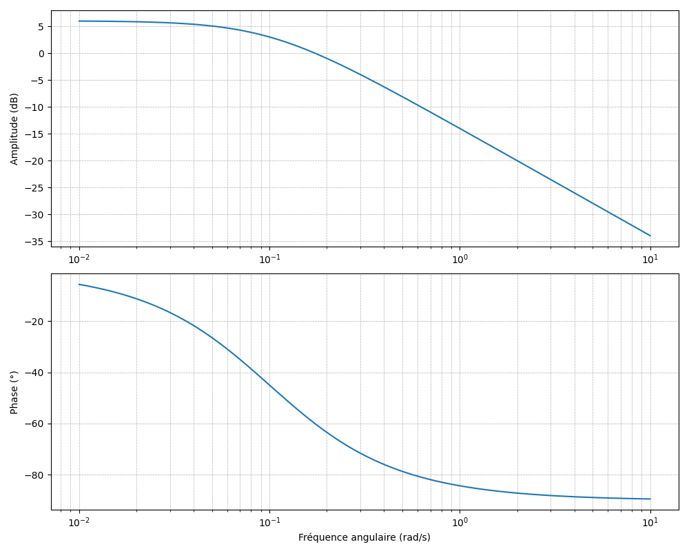
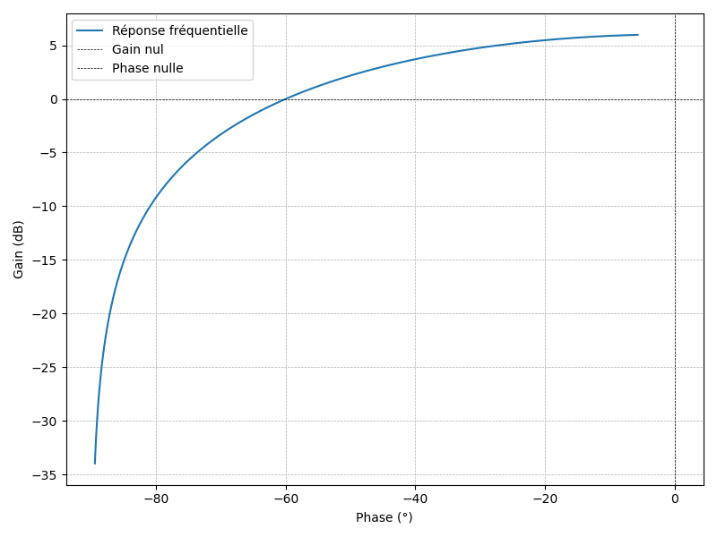
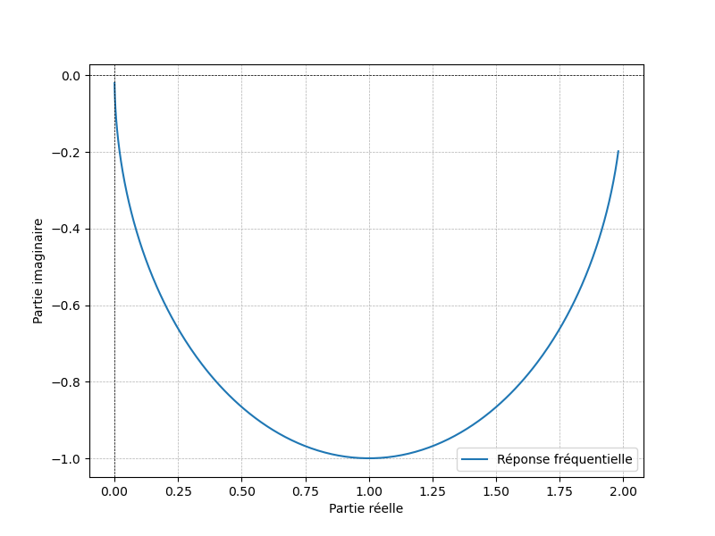
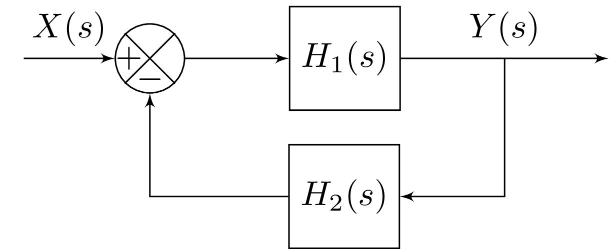

# Analyse des SLIT via la Transformée de Laplace

Après avoir décrit les SLIT à l’aide d’équations différentielles et de convolutions, ce chapitre présente un outil puissant pour résoudre et analyser ces systèmes: la transformée de Laplace.

## Transformée de Laplace

### Définition

La transformée de Laplace est une transformation qui convertit une fonction temporelle en une fonction dépendante d'une variable complexe $s$. Mathématiquement, elle est exprimée par :

$$F(s) = \mathcal{L}\{f(t)\} = \int_{0}^{\infty} f(t) e^{-st} dt$$

où $s$ est une variable complexe $s = \sigma + j\omega$, avec $\sigma$ représentant la partie réelle et $\omega$ la partie imaginaire.

### 

::: details Exemple : fonction échelon

A titre d'exemple, nous allons déterminer la transformée de Laplace de la fonction échelon unitaire $u(t)$. Pour $t \ge 0$, $u(t) = 1$, la transformée de Laplace est donc égale à : 

$$ U(s) = \mathcal{L}\{u(t)\} = \int_0^\infty 1 \cdot e^{-st} \, dt = \int_0^\infty e^{-st} dt $$

L'intégrale de $e^{-st}$ est :
$$ \int e^{-st} \, dt = -\frac{1}{s} e^{-st} $$

Nous évaluons cette expression aux bornes de $0$ à $\infty$ :
$$ \left[-\frac{1}{s} e^{-st} \right]_0^\infty = \left( -\frac{1}{s} e^{-s \cdot \infty} \right) - \left( -\frac{1}{s} e^{-s \cdot 0} \right) $$

* Lorsque $t \to \infty$, $e^{-st} \to 0$ si $s > 0$.
* Lorsque $t = 0$, $e^{-st} = e^{0} = 1$.

Pour $s > 0$, intégrale converge et est égale à : 

$$\mathcal{L}\{u(t)\} = \int_0^\infty 1 \cdot e^{-st} \, dt = \int_0^\infty e^{-st} dt =\frac{1}{s}$$

:::

### Propriétés

La transformée de Laplace possède plusieurs propriétés. Ces propriétés permettent de simplifier l'analyse des systèmes linéaires et invariants dans le temps.

#### 1. Linéarité
La transformée de Laplace est une opération linéaire :

$$\mathcal{L}\{a f(t) + b g(t)\} = a \mathcal{L}\{f(t)\} + b \mathcal{L}\{g(t)\}$$

où $a$ et $b$ sont des constantes, et $f(t)$ et $g(t)$ sont des fonctions de $t$.

::: details Démonstration

Pour démontrer cette propriété, nous devons appliquer la définition de la transformée de Laplace à la fonction $a f(t) + b g(t)$. 

$$
\begin{align*}
\mathcal{L}\{a f(t) + b g(t)\} &= \int_0^\infty \left( a f(t) + b g(t) \right) e^{-st} dt \\
&= \int_0^\infty a f(t) e^{-st} \, dt + \int_0^\infty b g(t) e^{-st} dt \\
&= a \int_0^\infty f(t) e^{-st} \, dt + b \int_0^\infty g(t) e^{-st} dt \\
&= a \mathcal{L}\{f(t)\} + b \mathcal{L}\{g(t)\}
\end{align*}
$$

:::

#### 2. Dérivation

La transformée de Laplace de la dérivée d'une fonction est donnée par :

$$\mathcal{L}\left\{\frac{d^n f(t)}{dt^n}\right\} = s^n F(s) - s^{n-1} f(0) - s^{n-2} f'(0) - \cdots - f^{(n-1)}(0)$$

où $F(s)$ est la transformée de Laplace de $f(t)$ et $f^{(n)}(0)$ représente la $n$-ième dérivée de $f(t)$ évaluée à $t = 0$. 

Lorsque toutes les conditions initiales sont nulles, $f^{(n)}(0)=0$ et donc 
$$\mathcal{L}\left\{\frac{d^n f(t)}{dt^n}\right\}= s^n F(s)$$

::: details Démonstration

Nous allons démontrer ici la propriété pour $n=1$. La demonstration pour les autres valeurs de $n$ s'obtient par induction.

La transformée de Laplace de $f'(t)$ est définie par :
$$ \mathcal{L}\{f'(t)\} = \int_0^\infty f'(t) e^{-st} \, dt $$

En utilisant l'intégration par parties, avec $u = e^{-st}$ et $dv = f'(t) dt$, nous avons :
$$ du = -s e^{-st} dt \quad \text{et} \quad v = f(t) $$

Ainsi, l'intégration par parties donne :
$$ \int_0^\infty f'(t) e^{-st} \, dt = \left[ f(t) e^{-st} \right]_0^\infty + s \int_0^\infty f(t) e^{-st} dt $$

Évaluons le premier terme $\left[ f(t) e^{-st} \right]_0^\infty$:
- À $t \to \infty$, si $f(t)$ ne croît pas plus vite qu'une exponentielle, $f(t) e^{-st} \to 0$.
- À $t = 0$, $f(0) e^{-s \cdot 0} = f(0)$.

Donc :
$$ \left[ f(t) e^{-st} \right]_0^\infty = 0 - f(0) = -f(0) $$

Ainsi, nous avons :
$$ \mathcal{L}\{f'(t)\} = -f(0) + s \int_0^\infty f(t) e^{-st} \, dt = -f(0) + s \mathcal{L}\{f(t)\} $$

Donc :
$$ \mathcal{L}\{f'(t)\} = s F(s) - f(0) $$

:::

#### 3. Intégration

La transformée de Laplace de l'intégrale d'une fonction est donnée par :

$$\mathcal{L}\left\{\int_0^t f(\tau) \, d\tau \right\} = \frac{F(s)}{s}$$

#### 4. Théorème du décalage dans le temps

Si une fonction $f(t)$ est décalée dans le temps de $t_0$ unités, la transformée de Laplace est modifiée comme suit :

$$\mathcal{L}\{f(t - t_0) u(t - t_0)\} = e^{-s t_0} F(s)$$
où $u(t)$ est la fonction échelon.

::: details Démonstration

Nous voulons trouver la transformée de Laplace de $f(t - t_0) u(t - t_0)$ où 
$u(t)$ est la fonction échelon unitaire. La fonction $f(t - t_0) u(t - t_0)$ est donc nulle pour $t < t_0$ et égale à $f(t - t_0)$ pour $t \ge t_0$. Nous calculons la transformée de Laplace de $f(t - t_0) u(t - t_0)$ en utilisant la définition :

$$\mathcal{L}\{f(t - t_0) u(t - t_0)\} = \int_0^\infty f(t - t_0) u(t - t_0) e^{-st} \, dt$$

Comme $f(t - t_0) u(t - t_0)$ est nul pour $t < t_0$, nous pouvons changer les bornes d'intégration de $0$ à $t_0$ en $t_0$ à $\infty$:

$$\mathcal{L}\{f(t - t_0) u(t - t_0)\} = \int_{t_0}^\infty f(t - t_0) e^{-st}dt$$

Pour simplifier cette intégrale, nous faisons un changement de variable. Posons $\tau = t - t_0$. Alors $dt = d\tau$ et lorsque $t$ varie de $t_0$ à $\infty$, $\tau$ varie de $0$ à $\infty$. L'intégrale devient :

$$\mathcal{L}\{f(t - t_0) u(t - t_0)\} = \int_0^\infty f(\tau) e^{-s(\tau + t_0)}d\tau$$

Nous pouvons séparer le facteur exponentiel en deux termes :
$$\mathcal{L}\{f(t - t_0) u(t - t_0)\} = \int_0^\infty f(\tau) e^{-s\tau} e^{-s t_0} d\tau$$
Comme $e^{-s t_0}$ est indépendant de $\tau$, nous pouvons le sortir de l'intégrale :
$$\mathcal{L}\{f(t - t_0) u(t - t_0)\} = e^{-s t_0} \int_0^\infty f(\tau) e^{-s\tau} d\tau$$

L'intégrale $\int_0^\infty f(\tau) e^{-s\tau}d\tau$ est la définition de la transformée de Laplace de $f(t)$, que nous avons notée $F(s)$. Donc :
$$\mathcal{L}\{f(t - t_0) u(t - t_0)\} = e^{-s t_0} F(s)$$

:::

#### 5. Multiplication par une exponentielle
La multiplication d'une fonction par une exponentielle se traduit par un décalage dans le domaine de la transformée de Laplace :

$$\mathcal{L}\{e^{at} f(t)\} = F(s - a)$$

#### 6. Théorème de convolution
La transformée de Laplace de la convolution de deux fonctions est le produit des transformées de Laplace de ces fonctions :

$$\mathcal{L}\{(f * g)(t)\} = F(s) G(s)$$
où $(f * g)(t) = \int_0^t f(\tau) g(t - \tau) d\tau$.

#### 7. Valeur initiale et valeur finale

- Théorème de la valeur initiale :

$$f(0^+)=\lim_{t \to 0^+} f(t) = \lim_{s \to \infty} s F(s)$$

- Théorème de la valeur finale :

$$f(\infty)=\lim_{t \to \infty} f(t) = \lim_{s \to 0} s F(s)$$

## Analyse des SLIT

### Hypothèses 

Considérons un SLIT d'ordre $N$ modélisé par une équation différentielle linéaire à coefficients constants
$$
a_n \frac{d^n y(t)}{dt^n} + \cdots + a_1 \frac{dy(t)}{dt} + a_0 y(t) = b_n \frac{d^n x(t)}{dt^n}  + \cdots + b_1 \frac{dx(t)}{dt} + b_0 x(t)$$

#### Conditions Initiales Nulles
Considérons également que les conditions initiales sont nulles c-à-d: 
* l'entrée et la sortie sont initialement nulles en $t=0$ :
$$x(0)=y(0)=0$$
* les dérivées $n$ieme de l'entrée et de la sortie sont nulles en $t=0$ pour tout $n<N$, 
$$x^{(n)}(0)=y^{(n)}(0)=0$$

### Fonction de transfert

La fonction de transfert d'un Système Linéaire Invariant dans le Temps (SLIT) est une représentation fondamentale qui relie la sortie du système à son entrée dans le domaine de Laplace. Elle est définie comme le rapport de la transformée de Laplace de la sortie à la transformée de Laplace de l'entrée, en supposant des conditions initiales nulles.

En appliquant la transformée de Laplace aux deux côtés de l'équation différentielle et en utilisant les propriétés de linéarité et de différentiation de la transformée de Laplace, nous obtenons :

$$
a_n s^n Y(s) + \cdots + a_1 s Y(s) + a_0 Y(s) = b_m s^m X(s) + \cdots + b_1 s X(s) + b_0 X(s)
$$
et après factorisation :

$$
(a_n s^n + \cdots + a_1 s + a_0) Y(s)= (b_m s^m + \cdots + b_1 s + b_0) X(s)
$$

La fonction de transfert $H(s)$ est alors définie comme le rapport de $Y(s)$ à $X(s)$:
$$
H(s) = \frac{Y(s)}{X(s)} = \frac{b_m s^m + \cdots + b_1 s + b_0}{a_n s^n + \cdots + a_1 s + a_0}
$$

Cette fonction de transfert caractérise complètement le comportement du SLIT dans le domaine de Laplace. L'expression sous la forme d'un ratio de deux polynômes correspond à la **représentation sous forme polynomiale** de la fonction de transfert.

::: details Exemple: fonction de transfert de premier ordre

A titre d'illustration, nous allons déterminer la fonction de transfert d'un système de premier ordre modélisé par l'équation différentielle suivante: 

$$
\tau \frac{dy(t)}{dt} + y(t) = K x(t)
$$

où :
* $\tau$ est la constante de temps du système,
* $K$ est le gain statique du système.

Pour trouver la fonction de transfert, nous appliquons la transformée de Laplace aux deux côtés de l'équation en supposant des conditions initiales nulles (c'est-à-dire $y(0) = 0$) :

$$
\tau \mathcal{L}\left\{\frac{dy(t)}{dt}\right\} + \mathcal{L}\{y(t)\} = K \mathcal{L}\{x(t)\}
$$

En utilisant la propriété de la transformée de Laplace de la dérivée, nous avons :

$$
\tau sY(s)  + Y(s) = K X(s)
$$

Nous pouvons maintenant isoler $Y(s)$ en factorisant :

$$
(\tau s + 1) Y(s) = K X(s)
$$

La fonction de transfert $H(s)$, définie comme le rapport de la transformée de Laplace de la sortie $Y(s)$ sur la transformée de Laplace de l'entrée $X(s)$, est alors égale à:

$$
H(s) = \frac{Y(s)}{X(s)} = \frac{K}{\tau s + 1}
$$

:::

#### Forme Factorisée

En déterminant les racines des polynômes au numérateur et au dénominateur, nous pouvons obtenir une **representation sous forme factorisée** de la fonction de transfert : 

$$
H(s) = \frac{K (s - z_1)(s - z_2) \cdots (s - z_n)}{(s - p_1)(s - p_2) \cdots (s - p_n)}
$$
où :
* $z_1, z_2, \ldots, z_n$ sont les zéros du système,
* $p_1, p_2, \ldots, p_n$ sont les pôles du système,
* $K$ est un facteur de gain.

#### Type du Système

Le **type du système** est un indicateur du **nombre d’intégrateurs** présents dans la chaîne directe du système, c’est-à-dire du **nombre de pôles situés à l’origine** du plan complexe.

Si une fonction de transfert possède **$L$ pôles à l’origine**, elle peut s'écrire sous la forme

$$
H(s) = K \frac{(s - z_1)(s - z_2) \cdots (s - z_m)}{s^L (s - p_{L+1})(s - p_{N-1}) \cdots (s - p_{N})}
$$

On dit alors que le système est **de type $N$**.

##### Représentation

Graphiquement, il est courant de représenter les pôles et les zéros dans le plan complexe via la **représentation des pôles et zéros**. La **représentation des pôles et zéros** sur le plan complexe permet d’analyser rapidement le comportement d’un système dynamique. Les **pôles** sont représentés par des croix $\times$ . Les **zéros** sont représentés par des cercles $\circ$ et indiquent les fréquences où la réponse du système est annulée ($H(s) = 0$).

<figure>
    
    <figcaption>Représentation des pôles et zéros d'un système d'ordre 4</figcaption>
</figure>

#### Lien avec la Réponse Impulsionnelle

La réponse impulsionnelle $h(t)$ d'un système est la réponse du système à une entrée impulsionnelle $\delta(t)$. Comme la transformée de Laplace de l'impulsion est $\mathcal{L}\{\delta(t)\}=1$, il en vient que 

$$
H(s) = \mathcal{L}\{h(t)\}
$$

La fonction de transfert correspond donc à la **transformée de Laplace de la réponse impulsionnelle**.

### Réponse temporelle à une entrée quelconque

Pour déterminer la réponse temporelle du système à une entrée quelconque $x(t)$, nous allons utiliser la stratégie suivante :

<figure>
    
</figure>

1. Obtention de la fonction de transfert du système $H(s)$
2. Détermination de la transformée de Laplace de l'entrée: $X(s)=\mathcal{L}[x(t)]$
3. Détermination de la transformée de Laplace de la sortie: $Y(s)=H(s)X(s)$
4. Calcul de la transformée de Laplace inverse de la sortie: $y(t)=\mathcal{L}^{-1}[Y(s)]$.

Pour l'étape 4, nous utiliserons le plus souvent la table des transformée de Laplace. Pour obtenir une forme présente dans la table, il est classique de recourir à une décomposition en éléments simples.

#### Stabilité

Les pôles correspondent simplement aux racines de l'équation caractéristique du système. Du coup, un système est BIBO stable si est seulement si tous ses pôles possèdent une partie réelle négative c-à-d $\Re e(p_n)<0$.

#### Valeur Finale

Lorsqu'un système est stable, sa réponse indicielle pour un échelon d'amplitude $E$ converge vers une valeur finie égale à 

$$y(\infty)=\lim_{t\to \infty} y(t)=H(0)E$$

::: details Démonstration

Lorsque l'entrée est un échelon d'amplitude $E$, la transformée de Laplace de la sortie est égale à 

$$Y(s)=H(s)X(s)=\frac{1}{s}H(s)E$$

En utilisant le théorème de la valeur finale, nous obtenons 

$$y(\infty) = \lim_{s\to 0} s Y(s) = \lim_{s\to 0} H(s)E=H(0)$$
:::

### Réponse Fréquentielle

Lorsque l'entrée du système est une exponentielle complexe de pulsation $\omega_0$, c-à-d $x(t)=e^{j\omega_0 t}$, la sortie est également une exponentielle complexe de même pulsation, multipliée par un gain complexe qui dépend de $\omega_0$ :

$$
y(t)= H(j\omega_0)e^{j\omega_0 t}
$$

Pour un système causal ($h(t)=0$ pour $t<0$), ce gain complexe est égal à 

$$
H(j\omega_0) = \left.H(s)\right|_{s=j\omega_0} =  \int_{0}^{\infty} h(t) e^{-j\omega_0 t}dt
$$

::: tip
Pour obtenir la réponse fréquentielle à partir de la fonction de transfert, il suffit de poser $s=j\omega$.
:::

::: details Exemple: Réponse fréquentielle d'un premier ordre

En posant $s = j\omega$, La réponse fréquentielle d'un système de premier ordre est donnée par :

$$
H(j\omega) = \frac{K}{1 + j\omega\tau}
$$

* **Module**: Le module de $H(j\omega)$ est donné par :

$$
|H(j\omega)| = \frac{K}{\sqrt{1 + (\omega\tau)^2}}
$$

* **Argument**: L'argument de $H(j\omega)$ est donné par :

$$
\arg[H(j\omega)] = -\arctan(\omega\tau)
$$

Ce système agit comme un filtre passe-bas, atténuant les hautes fréquences ($|H(j\omega)| \to 0$ lorsque $\omega \to \infty$) et introduisant un déphasage croissant ($\arg[H(j\omega)] \to -\pi/2$).

:::

#### Représentation 

La réponse fréquentielle est généralement un complexe. Il est courant d'en extraire son module $|H(j\omega)|$ et son argument $\arg[H(j\omega)]$.
Pour analyser et visualiser la réponse fréquentielle d'un système, plusieurs représentations graphiques sont couramment utilisées :

1. **Diagramme de Bode** :
   - **Amplitude** : Le module $|H(j\omega)|$ est exprimé en décibels ($20 \log_{10} |H(j\omega)|$) en fonction de la fréquence $\omega$ (généralement en échelle logarithmique).
   - **Phase** : L'argument $\arg[H(j\omega)]$ est tracé en degrés ou radians en fonction de $\omega$.
   - **Utilité** : Utilisé en électronique et en automatique pour évaluer la stabilité et la bande passante.

<figure>
    
    <figcaption>Diagramme de Bode</figcaption>
</figure>

2. **Diagramme de Black-Nichols** :
   - **Représentation** : Combine le gain (en dB) et la phase sur le même graphique (gain sur l’axe vertical, phase sur l’axe horizontal).
   - **Utilité** : Particulièrement utilisé dans la conception de correcteurs

<figure>
    
    <figcaption>Diagramme de Black-Nichols</figcaption>
</figure>

<!--
3. **Diagramme de Nyquist** :
   - **Représentation** : La réponse fréquentielle $H(j\omega)$ est représentée dans le plan complexe (partie réelle en abscisse, partie imaginaire en ordonnée).
   - **Utilité** : Fournit une vue directe du comportement fréquentiel du système et de ses caractéristiques de stabilité.

<figure>
    
    <figcaption>Diagramme de Nyquist</figcaption>
</figure>
-->

## Interconnexion des SLITs

Les SLITs peuvent être interconnectés de différentes manières pour former des systèmes plus complexes. Les configurations les plus courantes incluent la mise en série, la mise en parallèle et les boucles de rétroaction. La transformée de Laplace et les fonctions de transfert facilitent grandement l'analyse de ces interconnexions.

### 1. Mise en Série (Cascade)

<figure>
    
    <figcaption>Mise en série de 2 systèmes</figcaption>
</figure>

Lorsque deux systèmes sont mis en série, la sortie du premier système devient l'entrée du second. Si $H_1(s)$ et $H_2(s)$ sont les fonctions de transfert des deux systèmes, alors la fonction de transfert globale \(H(s)$ est donnée par le produit des fonctions de transfert individuelles :

$$
H(s) = H_1(s) H_2(s)
$$

::: details Exemple : mise en série de deux systèmes de premier ordre

Si $H_1(s) = \frac{1}{s+1}$ et $H_2(s) = \frac{1}{s+2}$, alors :

$$
H(s) = \frac{1}{s+1} \cdot \frac{1}{s+2} = \frac{1}{(s+1)(s+2)}
$$

:::

### 2. Mise en Parallèle

<figure>
    
    <figcaption>Mise en parallèle de 2 systèmes</figcaption>
</figure>

Lorsque deux systèmes sont mis en parallèle, les entrées des deux systèmes sont les mêmes et les sorties sont additionnées. Si $H_1(s)$ et $H_2(s)$ sont les fonctions de transfert des deux systèmes, alors la fonction de transfert globale $H(s)$ est donnée par la somme des fonctions de transfert individuelles :

$$
H(s) = H_1(s) + H_2(s)
$$

::: details Exemple : mise en parallèle de deux systèmes de premier ordre

Si $H_1(s) = \frac{1}{s+1}$ et $H_2(s) = \frac{2}{s+3}$, alors :

$$
H(s) = \frac{1}{s+1} + \frac{2}{s+3}
$$

:::

### 3. Boucle Fermée

<figure>
    
    <figcaption>Système avec une boucle de rétroaction</figcaption>
</figure>

Un système en boucle de rétroaction combine une partie de la sortie avec l'entrée. Il est composé :

- d'une **chaîne directe** $H_1(s)$
- d'une **chaîne de retour** $H_2(s)$ 

La fonction de transfert globale du système est donné par:
$$
H(s) = \frac{H_1(s)}{1 + H_1(s) H_2(s)}
$$

::: details Démonstration

Notons $\epsilon(s)$ la sortie du comparateur. En utilisant le schéma, nous pouvons écrire les deux équations

$$
\begin{align}
\epsilon(s) &= X(s) - H_2(s)Y(s)\\
Y(s) &=H_1(s)\epsilon(s)
\end{align}
$$

En combinant ces deux équations, nous obtenons $Y(s) =H_1(s)( X(s) - H_2(s)Y(s))$. En regroupant tous les termes en $Y(s)$ à gauche, nous obtenons :

$$Y(s)(1+H_1(s)H_2(s))=H_1(s)X(s)$$

La fonction de transfert de la boucle fermée est alors égale à 

$$
H(s) = \frac{Y(s)}{X(s)}=\frac{H_1(s)}{1 + H_1(s) H_2(s)}
$$

:::

::: details Exemple : boucle fermée avec deux systèmes de premier ordre

Si $H_1(s) = \frac{1}{s+1}$ et $H_2(s) = \frac{2}{s+3}$, alors :

$$
H(s) = \frac{\frac{1}{s+1}}{1 + \frac{1}{s+1} \cdot \frac{2}{s+3}} = \frac{(s+1)(s+3)}{(s+1)(s+3) + 2}
$$

:::
