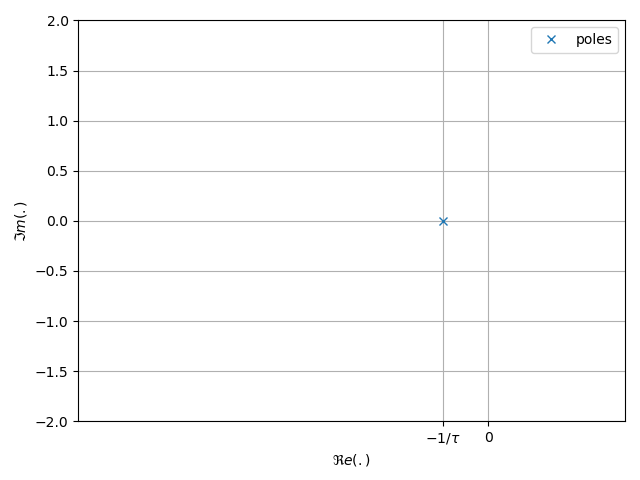
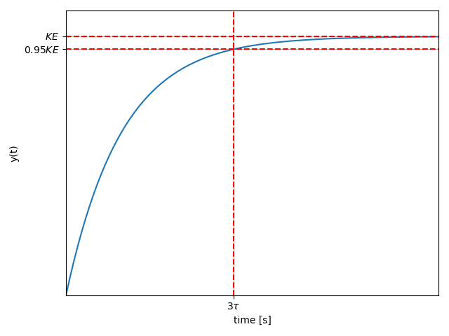
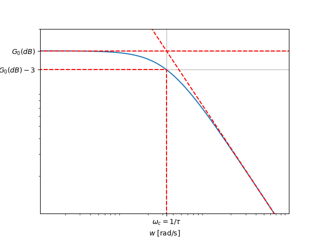

# Analyse des Systèmes de Premier Ordre

## Modélisation d'un système passe-bas (LP)

### Equation Différentielle

Un système LTI peut être décrit par une équation différentielle liant
l\'entrée $x(t)$ et la sortie $y(t)$. Pour les systèmes **passe-bas**
d\'ordre 1, cette équation différentielle est donnée par:

$$\tau \frac{d y(t)}{dt} + y(t)= Kx(t)$$

* $K$ : gain statique,
* $\tau$ : constante de temps (s).

### Fonction de Transfert

Pour faciliter l\'analyse des systèmes LTI, il est courant de recourir à
la notion de fonction de transfert. La fonction de
transfert d\'un système Passe-bas (LP) d\'ordre 1 est donnée par:

$$H(s)=\frac{Y(s)}{X(s)}=\frac{K}{\tau s +1}$$

### Pôles et Zéros

Un système Passe-bas (LP) d\'ordre 1 possède :

* un unique pôle négatif en $s=-\frac{1}{\tau}$,
* aucun zéro.

La figure suivante présente le diagramme des pôles et des zéros d'un filtre passe-bas de premier ordre. Ce système possède un unique pôle situé sur l'axe des réels. Lorsque $\tau > 0$, ce pôle est strictement négatif et le système est stable.

<figure>
    
    <figcaption>Diagramme des pôles et des zéros d'un premier ordre LP</figcaption>
</figure>

## Réponse Temporelle

Cette section montre comment obtenir la sortie du système pour différents signaux en entrée.

### Réponse Impulsionnelle

La réponse impulsionnelle correspond à la réponse du système lorsque l'entrée est une impulsion de Dirac d'amplitude $E$ ($x(t) = E \delta(t)$). Pour un système LP d'ordre 1, la réponse impulsionnelle est donnée par :

$$y(t) = \frac{KE}{\tau} e^{-\frac{t}{\tau}} u(t)$$

::: details Démonstration  
Dans le domaine de Laplace, une impulsion de Dirac d'amplitude $E$ est représentée par une constante $X(s) = E$. La sortie $Y(s)$ est alors donnée par :  

$$Y(s) = H(s) X(s) = \frac{K}{\tau s + 1} \cdot E$$  

On obtient donc :  

$$Y(s) = \frac{KE}{\tau s + 1}=\frac{KE}{\tau}\frac{1}{s + \frac{1}{\tau}}$$  

En utilisant la **transformée inverse de Laplace**, on reconnaît que la fonction suivante dans le domaine temporel :  

$$\mathcal{L}^{-1} \left( \frac{1}{s + \frac{1}{\tau}} \right) = e^{-\frac{t}{\tau}} u(t)$$  

Ainsi, on obtient directement :  

$$y(t) = \frac{KE}{\tau} e^{-\frac{t}{\tau}} u(t)$$  

où $u(t)$ est la fonction échelon.
::: 

#### Exemple

La figure suivante présente la réponse impulsionnelle d'un filtre passe-bas de premier ordre lorsque l'entrée est une impulsion d\'amplitude $E$.

<figure>
    
    <figcaption>Réponse impulsionnelle d'un premier ordre LP</figcaption>
</figure>

Il est possible d'établir que la réponse impulsionnelle présente les propriétés suivantes:

* Valeur initiale: $y(0^+)=\frac{KE}{\tau}$,
* Valeur finale:  $y(\infty)=0$,
* Valeur en $t_r=3\tau$, $y(3t_r)\approx 0.05\frac{KE}{\tau}$.

### Réponse Indicielle

La réponse indicielle correspond à la réponse du système lorsque
l\'entrée est un échelon d'amplitude $E$ ($x(t)=Eu(t)$). Pour un système LP d'ordre 1, la réponse indicielle est
donnée par :

$$y(t)=KE\left(1-e^{-\frac{1}{\tau}t}\right)u(t)$$

::: details Démonstration
Dans le domaine de Laplace, la sortie s'exprime sous la forme :

$$Y(s) = H(s)X(s)=\frac{KE}{s(\tau s + 1)}$$

En utilisant une décomposition en éléments simples, nous obtenons :

$$Y(s) = \frac{KE}{s(\tau s + 1)} = \frac{c_1}{s} + \frac{c_2}{\tau s + 1}$$

La constante $c_1$ s'obtient en multipliant $Y(s)$ par $s$ et en posant $s=0$:

   $$c_1 = \left.sY(s)\right|_{s=0}= \frac{KE}{\tau s + 1}=KE$$

La constante $c_2$ s'obtient en multipliant $Y(s)$ par $\tau s + 1$ et en posant $s=-1/\tau$:

   $$c_2 = \left.(\tau s + 1)Y(s)\right|_{s=-1/\tau} = \left.\frac{KE}{s}\right|_{s=-1/\tau} =-KE\tau$$

Ainsi, $Y(s)$ peut être écrit comme :

$$
Y(s) = \frac{KE}{s} - \frac{KE\tau}{\tau s + 1}
$$

En utilisant la transformée de Laplace inverse, nous obtenons finalement :
$$
y(t) = KE u(t) - KE e^{-\frac{t}{\tau}}u(t)=KE(1-e^{-\frac{t}{\tau}})u(t)
$$
:::

#### Exemple

La figure suivante présente l\'allure de la réponse indicielle lorsque l'entrée est un
échelon d\'amplitude $E$. 

<figure>
    
    <figcaption>Réponse indicielle d'un premier ordre LP</figcaption>
</figure>

La réponse indicielle suit une exponentielle
croissante et se stabilise vers une valeur finie. Il est possible de démontrer les propriétés suivantes:

* Valeur initiale : $y(0)=0$,
* Valeur finale : $y(\infty)=KE$,
* Temps de réponse à $\pm 5\%$ : $y(t_r)=0.95y(\infty)$ avec
    $t_r\approx 3\tau$ s,
* Pas de dépassement : $y(\infty)=\max(y(t))=KE$.

::: tip **Temps de réponse**

Pour un système de premier ordre, le temps de réponse à $\pm 5%$ est égal à $t_r=3\tau$.

:::

## Réponse Fréquentielle (Harmonique)

### Expression
La réponse fréquentielle d\'un système
passe-bas (LP) de premier ordre est donnée par :

$$ H(j\omega)=\frac{K}{1+j\omega \tau}=\frac{K}{1+j\frac{\omega}{\omega_c}}$$

avec $\omega_c=\frac{1}{\tau}$. La réponse fréquentielle est une fonction $\mathbb{R} \to \mathbb{C}$.
Pour analyser cette réponse, il est courant de recourir aux décompositions suivantes:

* Partie réelle / Partie imaginaire: $H(j\omega)=\Re e(H(j\omega)) +j\Im m(H(j\omega))$
* Module / argument: $H(j\omega)=|H(j\omega)|e^{j\arg(H(j\omega))}$

#### Partie Réelle et Partie Imaginaire

Pour un système passe-bas de premier ordre, la partie réelle et imaginaire de la réponse fréquentielle s'expriment sous la forme suivante: 

* Partie réelle:
$$
\Re e(H(j\omega)) = \frac{K}{1 + (\omega \tau)^2}
$$

* Partie imaginaire :
$$
\Im m(H(j\omega)) = -\frac{K \omega \tau}{1 + (\omega \tau)^2}
$$

#### Module et Argument

Pour un système passe-bas de premier ordre, le module et l'argument de la réponse fréquentielle s'expriment sous la forme:

* Module :

$$|H(j\omega)|=\frac{|K|}{\sqrt{1+(\omega\tau)^2}}$$

* Argument: 

$$\arg[H(j\omega)]=\arg[K]-\arctan(\omega\tau)$$

Notons que lorsque $K>0$, $\arg[K]=0$.

### Diagramme de Nyquist

Le diagramme de Nyquist présente l'ensemble la partie imaginaire $\Im m(H(j\omega))$ en fonction de la partie $\Re e(H(j\omega))$. la figure suivante présente la diagramme de Nyquist d'un système de premier ordre.

<figure>
    
    <figcaption>Diagramme de Nyquist d'un premier ordre LP</figcaption>
</figure>

La courbe résultante dans le plan complexe est une trajectoire semi-circulaire partant de 
$K$ (pour $\omega=0$) et tendant vers l'origine c-à-d 0 (pour $\omega \to \infty$). En $\omega_c = \frac{1}{\tau}$ (rad/s), nous obtenons $\Re e(H(j\omega_c))=\frac{K}{2}$ et $\Im m(H(j\omega_c))=-\frac{K}{2}$

### Diagramme de Bode

Le diagramme de Bode est composé de deux graphiques :
* le premier graphique présente le module $|H(j\omega)|$ (en dB) en fonction $\omega$ sur une échelle logarithmique. 
* le second graphique présente l'argument $\arg[H(j\omega)]$ (en deg) en fonction $\omega$ sur une échelle logarithmique. 

Les figures suivantes présentent l'allure du module et de l'argument pour un système passe-bas de premier ordre.

#### Représentation du module

<figure>
    
    <figcaption>Réponse fréquentielle d'un premier ordre LP: Module</figcaption>
</figure>

Le module évolue de $G_0(dB)=20\log_{10}(|K|)$ (pour $\omega=0$ rad/s) à $-\infty$ dB (pour $\omega \to \infty$).  En $\omega_c = \frac{1}{\tau}$ (rad/s), le module est égal à $|H(j\omega_c)|_{dB}=20\log_{10}(|K|)-3$ dB. Pour $\omega \gg \omega_c$, le module suit une asymptote égale :

$$\lim_{\omega \to \infty} |H(j\omega)|_{dB} \approx 20\log_{10}(|K|)-10\log_{10}\left(\frac{\omega}{\omega_c}\right)$$

::: tip **Pulsation de coupure**

Pour un système de premier ordre, la pulsation de coupure à $-3dB$ est égale à $\omega_c=\frac{1}{\tau}$.

:::

#### Représentation de l'argument

<figure>
    
    <figcaption>Réponse fréquentielle d'un premier ordre LP: Argument</figcaption>
</figure>

Lorsque $K>0$, l'argument évolue de $0^o$ (pour $\omega=0$ rad/s) à $-90^o$ (pour $\omega \to \infty$). En
$\omega_c = \frac{1}{\tau}$ (rad/s), l'argument est égal à $\arg[H(j\omega_c)] = -45^o$. Notons que si $K<0$, la phase est simplement translatée de $180$ degrés. 

### Diagramme de Black-Nichols

Le diagramme de Black-Nichols est une représentation où l'on trace l'argument $\arg(H(j\omega))$ en fonction du module $20\log_{10}(|H(j\omega)|)$ (en dB).

La figure suivante présente le diagramme de Black-Nichols pour un système passe-bas de premier ordre.
<figure>
    
    <figcaption>Diagramme de Black Nichols d'un premier ordre LP</figcaption>
</figure>

Pour $K>0$, lorsque $\omega$ évolue de $0$ à $\infty$, la courbe se déplace du point $( 20\log_{10}(|K|), 0^\circ)$ au point ($-\infty,  -90^\circ$). En $\omega_c = \frac{1}{\tau}$, la courbe passe par le point $(20\log_{10}(|K|) - 3~dB, -45^\circ)$.