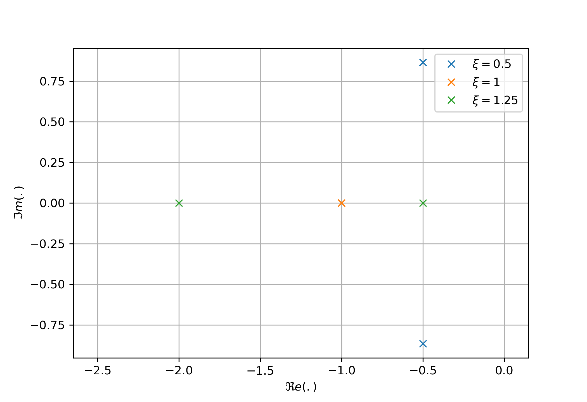
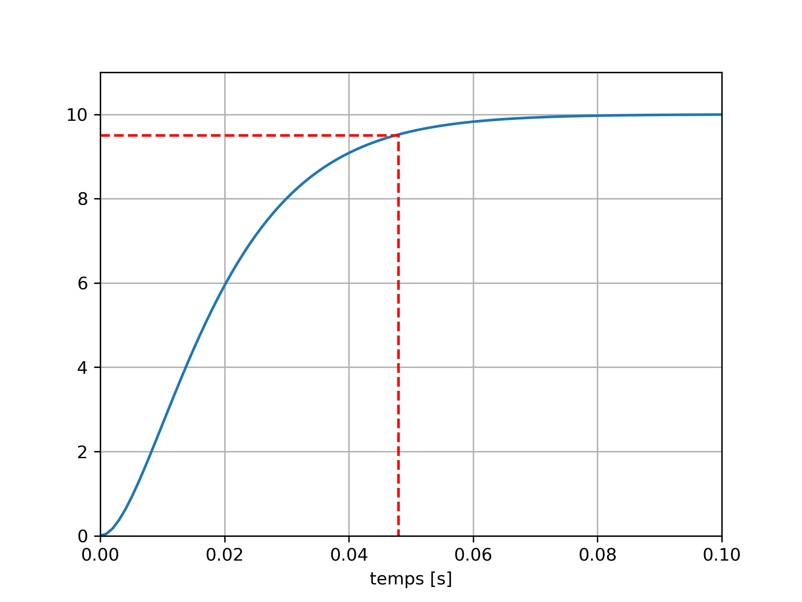
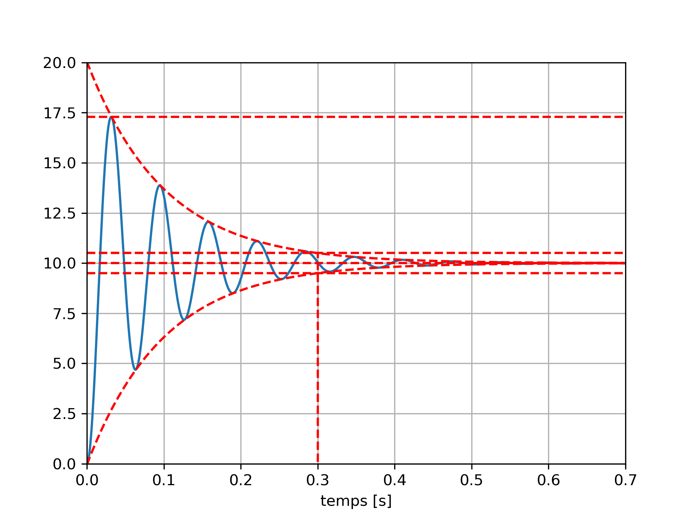
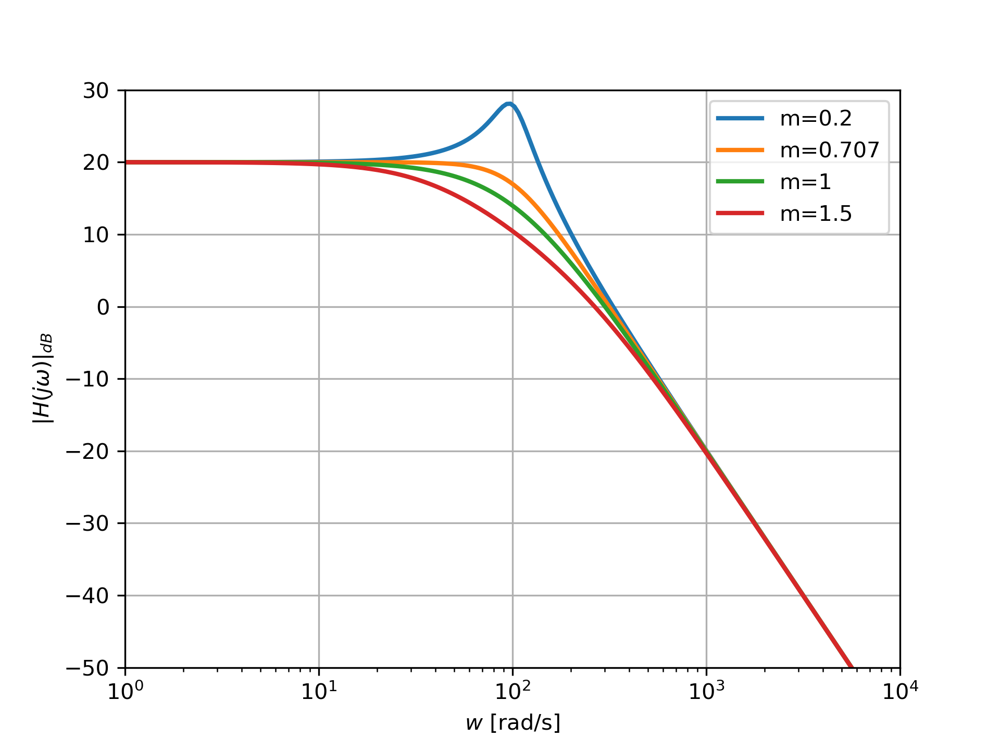
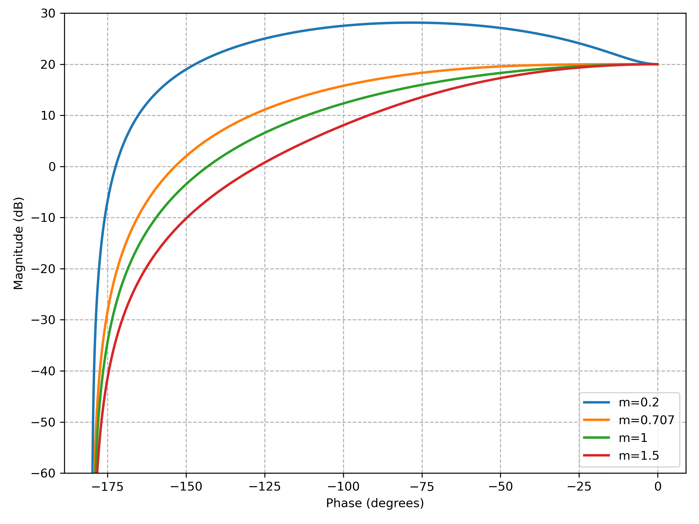

# Analyse des Systèmes de Second Ordre

Après avoir étudié les systèmes du premier ordre, nous abordons les systèmes de second ordre, qui décrivent une grande variété de phénomènes physiques (mécaniques, électriques, hydrauliques, etc.).
Leur comportement dépend fortement du coefficient d’amortissement $\xi$, qui détermine la présence ou non d’oscillations.

## Modélisation d'un système passe-bas (LP)

### Equation Différentielle

Pour un système passe-bas d'ordre 2, le lien entre l'entrée
et la sortie est donnée par l'équation différentielle suivante: 

$$\frac{1}{\omega_n^2}\frac{d^2 y(t)}{dt^2}+\frac{2\xi}{\omega_n}\frac{d y(t)}{dt}+y(t)=Kx(t)$$

* $K$ : gain statique,
* $\xi \ge 0$ : coefficient d\'amortissement,
* $\omega_n$ : pulsation naturelle ou naturelle (en rad/s).

Notons que certains ouvrages préfèrent utiliser, au lieu du paramètre
$\xi$, le facteur de qualité $Q=\frac{1}{2\xi}$.

### Fonction de Transfert

La fonction de transfert d\'un système passe-bas de second ordre est
donnée par :

$$H(s)=\frac{K}{\frac{1}{\omega_n^2}s^2+\frac{2\xi}{\omega_n}s+1}$$

### Pôles et Zéro

Les pôles $p_1$ et $p_2$ correspondent donc au racine du polynôme $\frac{1}{\omega_n^2}p^2+\frac{2\xi}{\omega_n}p+1$. La discriminant de polynôme est égal à $\Delta = \frac{4\xi^2}{\omega_n^2}-\frac{4}{\omega_n^2}=\frac{2}{\omega_n} \sqrt{\xi^2-1}$. Nous pouvons alors distinguer trois cas de figure.

* **Régime apériodique** ($\xi > 1$): Lorsque $\xi>1$, le système présente deux pôles réels d'expression :

$$p_{1, 2} = -\omega_n(\xi\pm \sqrt{\xi^2-1})$$

* **Regime critique** ($\xi = 1$): Lorsque $\xi=1$, le système présente un pôle réel **double**

$$p_{1, 2} = -\omega_n $$

* **Régime pseudo-périodique** ($0 < \xi <1$): Lorsque $0 < \xi <1$, le système présente une paire de pôles complexes-conjugués

$$p_{1, 2}=-\omega_n(\xi \pm j\sqrt{1-\xi^2})$$

::: tip **Identification lorsque $0 < \xi <1$**

Lorsque $0<\xi<1$, il est possible d'identifier rapidement la pulsation naturelle et le facteur d'amortissement à partir des pôles en exploitant le fait que $\omega_n=|p_{1, 2}|$ et que $\xi=-\Re e(p_{1,2})/|p_{1,2}|$.

:::

#### Exemple

La figure suivante présente le diagrammes des pôles et des zéros pour 3 systèmes de second ordre avec des coefficients d'amortissement différents. 
<figure>
    
    <figcaption>Diagramme des pôles et zéros d'un système de second ordre</figcaption>
</figure>

Lorsque $\xi > 1$, les pôles (représentés en vert) sont réels négatifs. Lorsque $\xi=1$, les pôles (représentés en orange) sont égaux et sont réels.

## Réponse Indicielle

L'allure de la réponse indicielle est dictée par la géométrie des pôles. Nous obtenons 3 cas de figures.

### Regime Apériodique ($\xi>1$)

Lorsque $\xi > 1$, la réponse indicielle s\'exprime sous la forme :

$$
y(t) = KE \left(1 +\frac{1}{\tau_1-\tau_2}\left(-\tau_1 e^{-\frac{t}{\tau_1}} + \tau_2  e^{-\frac{t}{\tau_2}}\right)\right)u(t)
$$
avec $\tau_1=-\frac{1}{p_1}$ et $\tau_2=-\frac{1}{p_2}$. 

::: details Démonstration
Dans le domaine de Laplace, la sortie s'exprime sous la forme :

$$Y(s) = H(s)X(s)=\frac{KE}{s(\frac{1}{\omega_n^2}s^2+\frac{2\xi}{\omega_n}s+1)}=\frac{KE\omega_n^2}{s(1+\tau_1 s)(1 +\tau_2s)}$$

avec $\tau_1=-\frac{1}{p_1}$ et $\tau_2=-\frac{1}{p_2}$

En utilisant une décomposition en éléments simples, nous obtenons :

$$Y(s) = \frac{c_0}{s} + \frac{c_1}{s+\frac{1}{\tau_1}} + \frac{c_2}{s+\frac{1}{\tau_2}}$$

avec :

* $c_0 = \left.sY(s)\right|_{s=0} = KE$
* $c_1 = \left.(s+\frac{1}{\tau_1})Y(s)\right|_{s=-\frac{1}{\tau_1}} = -\frac{KE\tau_1}{\tau_1-\tau_2}$
* $c_2 = \left.(s+\frac{1}{\tau_2})Y(s)\right|_{s=-\frac{1}{\tau_2}} = \frac{KE\tau_2}{\tau_1-\tau_2}$

En utilisant la transformée de Laplace inverse, nous obtenons alors :

$$
y(t) = KE \left(1 +\frac{1}{\tau_1-\tau_2}\left(-\tau_1 e^{-\frac{t}{\tau_1}} + \tau_2  e^{-\frac{t}{\tau_2}}\right)\right)u(t)
$$
:::

Il est possible de démontrer les propriétés suivantes:

*  Valeur initiale : $y(0)=0$,
*  Valeur finale : $y(\infty)=KE$,
*   Temps de réponse à $\pm 5\%$ : Pas de formule simple, **utilisation des abaques**.
*   Pas de dépassement : $y(\infty)=\max(y(t))=KE$.

::: tip **Pôle dominant**

Si $\tau_2 \gg \tau_1$, alors la réponse indicielle est quasi-identique à celle d'un premier ordre de constante de temps $\tau_2$ c-à-d $y(t) \approx KE \left(1- e^{-\frac{t}{\tau_2}}\right)u(t)$.

:::

#### Exemple

<figure>
    
    <figcaption>Réponse indicielle d'un système de second ordre</figcaption>
</figure>

La figure ci-dessus présente la réponse indicielle ($E=1$) d'un système de second ordre avec $K=10$, $\xi=2$ et $\omega_n=100$ rad/s. Ce système présente deux pôles en $p_1=-373.205$ et $p_2=-26.79$ (pôle dominant). Le système présente deux constantes de temps égales à $\tau_1=0.0026$s et $\tau_2=0.0373$s. Le temps de réponse du système peut être approché par $t_r=3\tau=0.111$s.

### Régime Critique ($\xi=1$)

Lorsque $\xi = 1$ (régime critique), les pôles du système de second ordre sont égaux et s’écrivent $p_1 = p_2 = -\omega_n$. Dans ce cas, la réponse indicielle s’exprime sous la forme :

$$
y(t) = KE \left(1 - \left(1 + \frac{t}{\tau}\right)e^{-\frac{t}{\tau}}\right)u(t)
$$

avec $\tau=\frac{1}{\omega_n}$.

::: details Démonstration

Dans le domaine de Laplace, la sortie s’exprime sous la forme :  
$$
Y(s) = H(s)X(s) = \frac{KE}{s \left(\frac{1}{\omega_n^2}s^2 + \frac{2}{\omega_n}s + 1\right)} = \frac{KE}{s(\tau s-1)^2}
$$

avec $\tau=\frac{1}{\omega_n}$

La fonction $Y(s)$ peut être décomposée en éléments simples :  
$$
Y(s) = \frac{c_0}{s} + \frac{c_1}{s + \frac{1}{\tau}} + \frac{c_2}{(s + \frac{1}{\tau})^2}
$$

avec :  

* $c_0 = KE$,
* $c_1 = -1$,
* $c_2 =  -\frac{KE}{\tau}$.

En utilisant la transformée de Laplace inverse, nous trouvons :  

$$y(t) = KE \left(1 - (1 + \frac{1}{\tau}t)e^{-\frac{t}{\tau}}\right)u(t)$$
:::

Il est possible de démontrer les propriétés suivantes:

*  Valeur initiale : $y(0)=0$,
*  Valeur finale : $y(\infty)=KE$,
*   Temps de réponse à $\pm 5\%$ : **utilisation des abaques**. Pour $\xi=1$, $\omega_n t_r\approx 4.8$.
*   Pas de dépassement : $y(\infty)=\max(y(t))=KE$.

#### Exemple

<figure>
    
    <figcaption>Réponse indicielle d'un système de second ordre</figcaption>
</figure>

La figure ci-dessous présente la réponse indicielle ($E=1$) d'un système de second ordre avec $K=10$, $\xi=1$ et $\omega_n=100$ rad/s. Ce système présente un pôle double en $p_1=p_2=-100$. Le temps de réponse est approximativement égal à $t_r = 4.8/100=0.048$s.

### Regime Pseudo-Périodique ($0<\xi<1$)

La réponse indicielle s\'exprime sous la forme :

$$y(t)=KE\left(1-e^{-\xi\omega_nt}\left(\cos\left(\omega_p t\right)+\frac{\xi}{\sqrt{1-\xi^2}}\sin\left(\omega_p t\right)\right)\right)u(t)$$

où $\omega_p = \omega_n\sqrt{1-\xi^2}$ correspond à la pseudo-pulsation.

::: details Démonstration

Dans le domaine de Laplace, la sortie s’exprime sous la forme :  
$$
Y(s) = H(s)X(s) = \frac{KE}{s \left(\frac{1}{\omega_n^2}s^2 + \frac{2\xi}{\omega_n}s + 1\right)} 
= \frac{KE \omega_n^2}{s \left(s^2 + 2\xi \omega_n s + \omega_n^2\right)} 
$$
Lorsque $0<\xi<1$, il est possible d'écrire $Y(s)$ sous la forme :
$$
Y(s) = \frac{KE \omega_n^2}{s \left((s+\omega_n \xi)^2+\omega_n^2(1-\xi^2)\right)}
$$
En posant $\omega_p^2 = \omega_n^2(1-\xi^2)$ et $a=\omega_n \xi$, il est possible de décomposer cette transformée de Laplace sous la forme :
$$
Y(s) = \frac{c_0}{s} + \frac{c_1(s+a)}{(s+a)^2+\omega_p^2}+\frac{c_2\omega_p}{(s+a)^2+\omega_p^2}
$$

Par identification, nous obtenons :

$$KE \omega_n^2 = c_0(s^2+2as + \omega_n^2) + c_1s(s+a) + c_2\omega_p s $$

En identifiant par rapport aux différentes puissances de $s$, nous obtenons le systèmes :

$$
\begin{align}
KE \omega_n^2&=c_0\omega_n^2\\
0 & =2ac_0+ac_1 + c_2\omega_p\\
0 & = c_0 +c_1
\end{align}
$$
Après resolution du système, nous obtenons $c_0=KE$, $c_1=-KE$ et $c_2=-\frac{\xi}{\sqrt{1-\xi^2}}KE$. En appliquant la transformée de Laplace inverse, nous obtenons :

$$y(t)=KE\left(1-e^{-\xi\omega_nt}\left(\cos\left(\omega_p t\right)+\frac{\xi}{\sqrt{1-\xi^2}}\sin\left(\omega_p t\right)\right)\right)u(t)$$

:::

Il est possible de démontrer les propriétés suivantes:

* Valeur initiale : $y(0)=0$,
* Valeur finale : $y(\infty)=KE$,
* Temps de réponse à $\pm 5\%$ : Pas de formule simple, **utilisation des abaques**.
* Présence d\'oscillations à la pseudo-pulsation (rad/s): $\omega_p = \omega_n\sqrt{1-\xi^2}$
* Premier Dépassement relatif : $D_r(\%)=100\times e^{\frac{-\pi \xi}{\sqrt{1-\xi^2}}}$, **utilisation des abaques**.

::: tip **Pseudo-période**

Lorsque $0<\xi<1$, la réponse indicielle est une sinusoide amortie de pseudo-periode :

$$T_p = \frac{2\pi}{\omega_p} =\frac{2\pi}{\omega_n\sqrt{1-\xi^2}}$$

:::

#### Exemple

<figure>
    
    <figcaption>Réponse indicielle d'un système de second ordre</figcaption>
</figure>

La figure ci-dessus présente la réponse indicielle ($E=1$) d'un système de second ordre avec $K=10$, $\xi=0.1$ et $\omega_n=100$ rad/s. Ce système présente une paire de poles complexes-conjugués $p_{1,2}=p_2=-10.+99.498j$. La pseudo-pulsation est donnée par $\omega_p = 99.498$ rad/s et la pseudo-période est égale à $T_p=0.0631$s. En utilisant les abaques, nous trouvons un temps de réponse $t_r = 30/100=0.3$s et un premier dépassement relatif de $73\%$.

## Réponse Fréquentielle

### Expression

La réponse fréquentielle d\'un système passe-bas de second ordre est donnée par :

$$H(j\omega)=\frac{K}{1-\frac{\omega^2}{\omega_n^2}+j\frac{2\xi\omega }{\omega_n}}=\frac{K}{1-\Omega^2+2j\xi\Omega}$$

où $\Omega=\frac{\omega}{\omega_n}$ correspond à la pulsation réduite.

#### Partie Réelle et Partie Imaginaire

Pour un système passe-bas de second ordre, la partie réelle et imaginaire de la réponse fréquentielle s'expriment sous la forme suivante: 

* Partie réelle:
$$
\Re e(H(j\omega)) = \frac{K \left(1 - \Omega^2\right)}{\left(1 - \Omega^2\right)^2 + 4\xi^2\Omega^2}
$$

* Partie imaginaire :
$$
\Im m(H(j\omega)) = -\frac{2K \xi\Omega}{\left(1 - \Omega^2\right)^2 + 4\xi^2\Omega^2}
$$

#### Module et Argument

Pour un système passe-bas de second ordre, le module et l'argument de la réponse fréquentielle s'expriment sous la forme:

* Module: 

$$|H(j\omega)|=\frac{|K|}{\sqrt{\left(1-\Omega^2\right)^2+4\xi^2\Omega^2}}$$

* Argument : 

$$\arg[H(j\omega)]=\arg[K] - \arctan\left(\frac{2\xi\omega}{1-\Omega^2}\right)-\varphi$$

où $\varphi=0$ si $1-\Omega^2> 0$ et $\varphi=\pi$ si $1-\Omega^2<0$. Notons que lorsque $K>0$, $\arg[K]=0$.

::: tip **Point Remarquable**

A la pulsation $\omega=\omega_n$, le module et l'argument sont respectivement donnés par $|H(j\omega)|=\frac{|K|}{2\xi}$ et $\arg[H(j\omega)]=\arg[K]-\frac{\pi}{2}$.

:::

::: tip **Résonance**

Lorsque $\xi < \frac{1}{\sqrt{2}}\approx 0.707$, le module présente un extrémum en $\omega_r=\omega_n\sqrt{1-2\xi^2}$, où $\omega_r$ désigne la pulsation de résonance. Cet extrémum est caractérisé par le facteur de résonance $M_{dB}=20\log_{10}(|H(j\omega_r)|/|K|)$. Les abaques de second ordre permettent d'obtenir $M_{dB}$ en fonction du facteur d'amortissement $\xi$.

:::

### Diagramme de Nyquist

<figure>
    
    <figcaption>Diagramme de Nyquist d'un système de second ordre</figcaption>
</figure>

La figure ci-dessus présente les diagrammes de Nyquist de plusieurs systèmes de second ordre avec $K=10$, $\omega_n=100$ et $\xi \in \{0.2, 0.707, 1, 1.5\}$.

### Diagramme de Bode

#### Représentation du module

<figure>
    
    <figcaption>Réponse fréquentielle d'un système de second ordre: Module</figcaption>
</figure>

La figure ci-dessus présente le module du diagramme de Bode de plusieurs systèmes de second ordre avec $K=10$, $\omega_n=100$ et $\xi \in \{0.2, 0.707, 1, 1.5\}$. Pour les 4 systèmes, le module à la pulsation $\omega_n$ est égal à $|H(j\omega_n)|_{dB}=20-20\log_{10}(2\xi)$. Plus $\xi$ est petit, plus $|H(j\omega_n)|$ est élevé. Lorsque $\xi<0.707$, le module présente une résonance. Le seul système présentant une résonance est le système pour lequel $\xi=0.2$. Ce système présente une résonance à la pulsation $\omega_r=95.916$ rad/s (voir formule). Le facteur de résonance associé est égal à $M_{dB}=8.1$ dB (voir abaque). 

#### Représentation de l'argument

<figure>
    
    <figcaption>Réponse fréquentielle d'un système de second ordre: Argument</figcaption>
</figure>

La figure ci-dessus présente le module du diagramme de Bode de plusieurs systèmes de second ordre avec $K=10$, $\omega_n=100$ et $\xi \in \{0.2, 0.707, 1, 1.5\}$. Pour les 4 systèmes, l'argument évolue de $0^o$ (pour $\omega=0$ rad/s) à $-180^o$ (pour $\omega \to \infty$). En
$\omega= \omega_n$ (rad/s), l'argument est égal à $\arg[H(j\omega_n)] = -90^o$ quelque soit la valeur de $\xi$. Notons que si $K<0$, la phase est simplement translatée de $180$ degrés.

### Diagramme de Black-Nichols

<figure>
    
    <figcaption>Diagramme de Black Nichols d'un second ordre LP</figcaption>
</figure>

La figure suivante présente les diagrammes de Black-Nichols de plusieurs systèmes passe-bas de second ordre avec $K=10$, $\omega_n=100$ et $\xi \in \{0.2, 0.707, 1, 1.5\}$. Pour $K>0$, lorsque la pulsation $\omega$ évolue de $0$ à $\infty$, la courbe se déplace du point $( 20~dB, 0^\circ)$ au point ($-\infty,  -180^\circ$). Lorsque $\xi \ge 0.707$, la courbe est monotone. Pour $\xi=0.2$, la courbe présente un extrémum à la pulsation $\omega_r=95.916$ rad/s. Le facteur de résonance associé est égal à $M_{dB}=8.1$ dB (voir abaque). En $\omega = \omega_n$, la courbe passe par le point remarquable $(20- 20\log_{10}(2\xi), -90^\circ)$ quelque soit la valeur de $\xi$.
