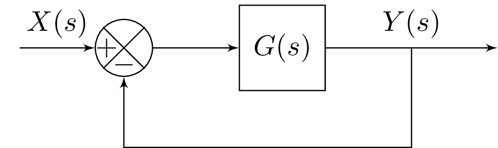

# Contexte & Hypothèses

## Contexte

Ce chapitre développe une méthodologie pour analyser le comportement d’un système en boucle fermée au travers de plusieurs critères :

* la stabilité : lien entre pôles et stabilité, critère du revers, marges de robustesse.
* les performances statiques : influence de la type du système sur la précision et le rejet des perturbations.
* les performances dynamiques : estimation graphique des paramètres temporels via l’abaque de Black-Nichols et l’approximation second ordre.

## Hypothèses

L'ensemble de ce chapitre considère que la chaine de retour est **unitaire**.

<figure>
    
    <figcaption>Système bouclé avec un Retour Unitaire</figcaption>
</figure>

Dans ce chapitre, nous adopterons les notations suivantes:

* $G(s)$: fonction de transfert du système en **boucle ouverte**,
* $H(s)$ : fonction de transfert du système en **boucle fermée**.

En particulier, en utilisant la formule de la boucle fermée, la fonction de transfert du système bouclé peut s'écrire sous la forme :

$$H(s) = \frac{G(s)}{1+G(s)}$$