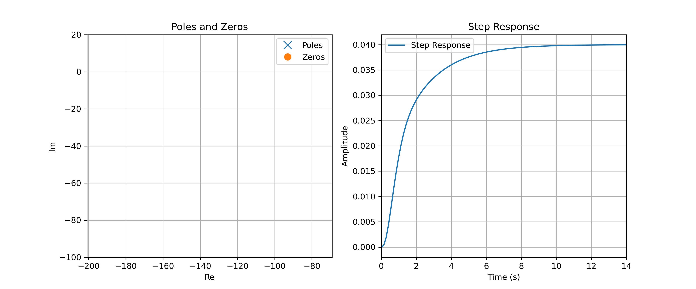
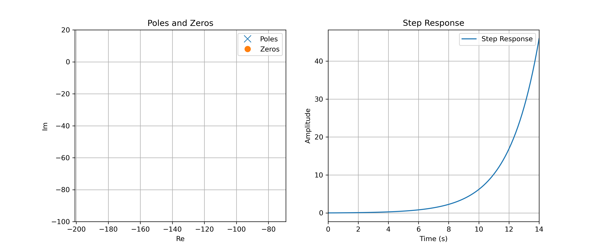

# Stabilité des Systèmes en Boucle Fermée

## Objectif

Dans ce chapitre, nous montrons comment analyser la stabilité d'un système en boucle fermée à partir du lieu de Black de la boucle ouverte.

### Cadre général: stabilité BIBO 

Un système est dit BIBO stable si lorsque son entrée est bornée, sa sortie l'est également. Pour les systèmes continus, un système est BIBO stable si et seulement si sa réponse impulsionnelle est absolument intégrable c-à-d :

$$\int_{-\infty}^{\infty}|h(t)|dt < \infty$$

### Condition sur les pôles

La fonction de transfert d'un système d'ordre $n$ peut s'écrire sous la forme factorisée suivante :

$$
H(s) = \frac{K (s - z_1)(s - z_2) \cdots (s - z_n)}{(s - p_1)(s - p_2) \cdots (s - p_n)}
$$
où $z_1, z_2, \ldots, z_n$ sont les zéros du système, $p_1, p_2, \ldots, p_n$ sont les pôles du système, et $K$ est un facteur de gain (potentiellement différent du gain statique $H(0)$).

Au niveau temporel, chaque pôle $p_k$ est associé soit :

* à une composante du type $e^{p_k t}u(t)$ pour les pôles réels $p_k$,
* à une composante du type $e^{\Re e(p_k) t}\cos(\omega t+\varphi)u(t)$ pour les pôles complexes-conjugués $p_k=\Re e(p_k)\pm j\Im m(p_k)$.

Nous constatons alors que, pour qu'un système soit stable, les arguments des termes exponentiels doivent être négatifs. Cette propriété permet de relier directement la notion de stabilité aux pôles du système

::: tip **Stabilité**

Un SLIT continu est BIBO stable si la partie réelle de tous ses pôles est négative c-à-d que

$$\Re e(p_k) < 0$$

pour tout pôle $k$.

:::

#### Exemples

Les figures suivantes présentent les diagrammes des pôles et des zéros de deux systèmes, ainsi que leur réponse indicielle (avec $E=1$). 

##### Système Stable 

<figure>
    
    <figcaption>Diagramme des Pôles et des Zéros: système stable</figcaption>
</figure>

Dans la première figure, l'ensemble des pôles est situé sur le demi-plan gauche, c-à-d que tous les pôles ont une partie réelle négative. L'allure de la réponse indicielle permet de confirmer que le système est bien stable.

##### Système Instable 

<figure>
    
    <figcaption>Diagramme des Pôles et des Zéros: système instable</figcaption>
</figure>

Dans la seconde figure, un pôle possède une partie réelle positive ($p=0.5>0$). La figure de droite montre que la réponse indicielle diverge, confirmant l’instabilité 

## Cas de la Boucle fermée 

Pour analyser la stabilité du système en **boucle fermée** $H(s)$ à partir du système en boucle ouverte $G(s)$, une approche possible repose sur le diagramme de Black-Nichols du système **en boucle ouverte**.

### Lieux de Black et critère du revers

Le diagramme de Black-Nichols du système en boucle ouverte $G(s)$ présente l'évolution du module en dB, $|G(j\omega)|_{dB}$, en fonction de l'argument en degré, $\arg[G(j\omega)]_{deg}$. Cette courbe est appelée **lieu de Black**. Dans ce graphique, le comportement du lieu de Black au voisinage du point $(-180^o, 0 dB)$ permet de conclure sur la stabilité du système en boucle fermée.

::: tip Critère du revers

Pour qu’un système à retour unitaire soit stable en boucle fermée, le lieu de Black du système en boucle ouverte $G(s)$ doit laisser le point critique, de coordonnées $(-180^{o}, 0dB)$, à sa droite lorsque $\omega$ varie de $0$ à $+\infty$. 

:::

#### Exemples

Les figures suivantes présentent les lieux de Black de deux systèmes de 3ieme ordre, ainsi que leur réponse indicielle en boucle fermée (avec $E=1$). 

##### Système stable en boucle fermée

<figure>
    
    <figcaption>Système stable en boucle fermée</figcaption>
</figure>

La figure ci-dessus présente le lieu de Black d'un système **en boucle ouverte** $G(s)$. Lorsque l'on parcourt la courbe dans le sens des $\omega$ croissant, le lieux de Black se déplace de la droite vers la gauche. En parcourant la courbe dans le sens des $\omega$ croissant, le point critique de coordonnée $(-180^{o}, 0dB)$ est laissé sur la droite. L'application du critère du revers permet de conclure que le système est stable en **boucle fermée**. Dans la figure de droite, nous observons effectivement que la réponse indicielle du système en boucle fermée ne diverge pas.

##### Système instable en boucle fermée

<figure>
    
    <figcaption>Système stable en boucle fermée</figcaption>
</figure>

La figure ci-dessus présente le lieu de Black d'un système **en boucle ouverte** $G(s)$. En parcourant la courbe dans le sens des $\omega$ croissant, le point critique est laissé sur la gauche. L'application du critère du revers permet donc de conclure que le système est instable en **boucle fermée**. Dans la figure de droite, nous observons effectivement que la réponse indicielle du système en boucle fermée diverge.

### Marges de Gain et de Phase

Le critère de stabilité est un critère dur: le système est soit stable, soit instable. En pratique, il est souvent préférable de recourir à des critères numérique pour caractériser la stabilité "relative" d'un système en boucle fermée. Dans ce contexte, deux critères sont couramment utiliser :

* **Marge de Phase $M_{\varphi}$** : Distance en degrée par rapport au point critique lorsque $|G(j\omega)|_{dB}=0 dB$.
* **Marge de Gain $M_{G}$** : Distance en dB par rapport au point critique lorsque $\arg[G(j\omega)]_{deg}=-180^o$.

Lorsqu'un système est stable en boucle fermée, ces deux marges sont positives.

#### Exemple

<figure>
    
    <figcaption>Lieu de Black</figcaption>
</figure>

A titre d'exemple, la figure ci-dessus présente le lieu de Black d'un système de 3ieme ordre. Ce système est stable en boucle fermée. Concernant les marges, nous obtenons une marge de Gain $M_{G}=12 dB$ et une marge de phase de $M_{\varphi}=67^o$.

::: info Correction et Apport de Phase

Pour gagner en stabilité en boucle fermée, un stratégie de correction possible consiste à "apporter" de la phase en boucle ouverte (translation du lieu de Black vers la droite).

:::