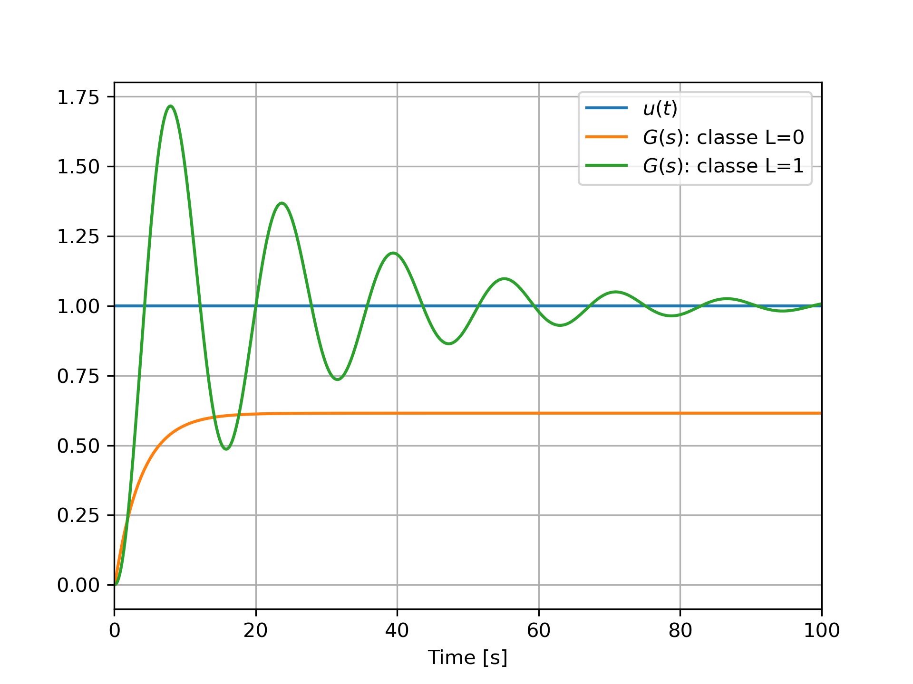
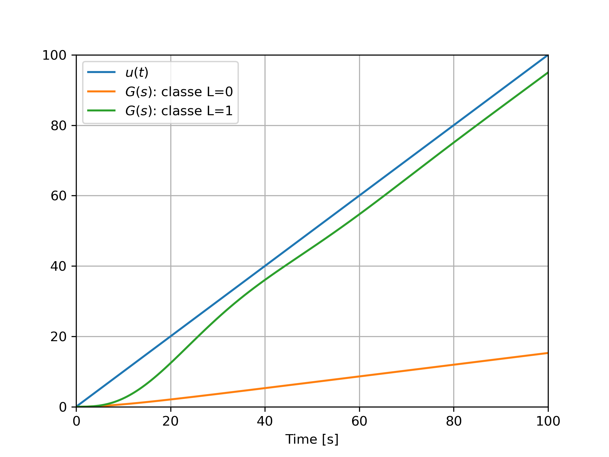

# Performances Statiques des Systèmes Bouclés

Cette section analyse la précision des systèmes bouclés en fonction de la classe du système en boucle ouverte. Il détaille l’évaluation de l’erreur en régime permanent face à des signaux d’entrée (échelon, rampe) et montre comment l’ajout d’intégrateurs influence la précision. La problématique du rejet des perturbations est également abordée, mettant en évidence le rôle fondamental de la classe du système pour assurer robustesse et atténuation des perturbations.

## Objectif

Dans ce chapitre, nous montrons comment analyser les performances statiques d'un système en boucle fermée (précision, rejet des perturbations) à partir de la classe du système en boucle ouverte.

### Classe du système

Le comportement du système en boucle fermée va directement dépendre de la **classe** du système en boucle ouverte.

La classe d’un système est définie par le nombre d’intégrateurs purs (pôles à l’origine) présents dans la fonction de transfert en boucle ouverte. En utilisant la forme factorisée, la fonction de transfert d'un système de classe $L$ peut s'écrire sous la forme :

$$
G(s) = \frac{K (s - z_1)(s - z_2) \cdots (s - z_n)}{s^L(s - p_1)(s - p_2) \cdots (s - p_n)}
$$

* $L$: classe du système
* $G(0)$: gain statique du système.

## Précision

La précision d'un système peut être mesurée en évaluant l'erreur de poursuite entre l'entrée et la sortie du système $\epsilon(t)=x(t)-y(t)$. Plus spécifiquement, il est courant de se focaliser sur la valeur de l'erreur de poursuite en régime permanent $\epsilon(\infty)$. 

### Cas général 

L'erreur en régime permanent s'exprime sous la forme :
$$
\epsilon(\infty) = \lim_{s\to 0}s(X(s)-Y(s))=\lim_{s\to 0} \frac{sX(s)}{1+G(s)}
$$
Dans les sections suivantes, nous allons évaluer l'expression de $\epsilon(\infty)$ pour différents signaux d'entrée $x(t)$.

### Réponse Indicielle

Lorsque $x(t)=Eu(t)$, l'erreur en régime permanent est égale à :

$$
\epsilon(\infty) =\lim_{s\to 0} \frac{E}{1+G(s)}
$$

* Si $L=0$, l'erreur en régime permanent est égale à 
$\epsilon(\infty)=\frac{E}{1+G(0)}$. 
* Si $L\ge 1$, l'erreur en régime permanent est nulle.

::: info **Correction**

Pour obtenir un système précis, un stratégie de correction possible consiste à ajouter un "intégrateur" en boucle ouverte.

:::

#### Exemple

<figure>
    
    <figcaption>Réponse indicielle du système en boucle fermée</figcaption>
</figure>

La figure ci-dessus présente la réponse indicielle en boucle fermée de deux systèmes : le premier système possède une boucle ouverte $G(s)$ de classe $L=0$, et le second système possède une boucle ouverte $G(s)$ de classe $L=1$. Nous pouvons observer que l'erreur en regime permanent, c-à-d la différence entre l'entrée $x(t)$ et la sortie $y(t)$ lorsque $t\to \infty$, est non-nulle pour le premier système (classe $L=0$) alors quelle est nulle pour le second système (classe $L=1$). Lorsque $L=1$, le système en boucle fermée est donc précis.

### Réponse à une rampe

Lorsque $x(t)=Etu(t)$, l'erreur en régime permanent est égale à :

$$
\epsilon(\infty) =\lim_{s\to 0} \frac{E}{sG(s)}
$$

* Si $L=0$, l'erreur en régime permanent est égale 
$\epsilon(\infty)=\pm \infty$. 
* Si $L\ge 1$, l'erreur en régime permanent est égale à
$\epsilon(\infty)=\frac{E}{G_1}$ où $G_1 = \lim_{s\to 0} sG(s)$
* Si $L\ge 2$, l'erreur en régime permanent est nulle.

#### Exemple

<figure>
    
    <figcaption>Réponse à une rampe du système en boucle fermée</figcaption>
</figure>

La figure ci-dessus présente la réponse à une rampe en boucle fermée de deux systèmes : le premier système possède une boucle ouverte $G(s)$ de classe $L=0$, et le second système possède une boucle ouverte $G(s)$ de classe $L=1$. Nous pouvons constater que l'erreur en regime permanent est infinie pour le premier système (classe $L=0$) car les rampes d'entrée et de sortie n'ont pas la même pente. L'erreur est finie pour le second système (classe $L=1$). Notons que dans le cas où $L\ge 2$, il est très difficile d'obtenir un système stable en boucle fermée.

### Synthèse

La tableau suivant résume l'expression de l'erreur en régime permanent pour des entrées de type échelon ou rampe en fonction de la classe du système en boucle ouverte. Dans ce tableau, $G_l=\lim_{s\to 0} s^l G(s)$.

| Classe $L$ | Échelon $Eu(t)$                 | Rampe $Et$               |
|----------------|-------------------------------------|---------------------------------|
| $L = 0$    | $\epsilon(\infty) = \frac{E}{1 + G_0}$ | $\epsilon(\infty) = \infty$    |
| $L = 1$    | $\epsilon(\infty) = 0$               | $\epsilon(\infty) = \frac{E}{G_1}$ |
| $L = 2$    | $\epsilon(\infty) = 0$               | $\epsilon(\infty) = 0$             |

## Rejet des perturbations

Dans de nombreux systèmes réels, des perturbations extérieures peuvent affecter les performances du système bouclé. Pour obtenir un système robuste, il est nécessaire de limiter l'impact de ces perturbations sur la sortie. Dans cette section, nous nous focalisons sur le cas classique où la perturbation $d(t)$ agit en sortie du système en boucle ouverte.

<figure>
    
    <figcaption>Système bouclé avec un Retour Unitaire et une perturbation</figcaption>
</figure>

* $G(s)$: fonction de transfert du système en boucle ouverte, 
* $D(s)$: transformée de Laplace de la perturbation.

### Cas général

Notons respectivement $y_x(t)$ et $y_d(t)$ la sortie du système lorsque la perturbation est nulle et lorsque la consigne est nulle. Dans le cas général, la sortie s'exprime dans le domaine de Laplace sous la forme :

$$Y(s) = Y_x(s) + Y_d(s) = H(s)X(s) + N(s)D(s)$$

* $H(s)=\frac{G(s)}{1+G(s)}$ correspond à la fonction de transfert en boucle fermée sans perturbation,
* $N(s)=\frac{1}{1+G(s)}$ correspond à la fonction de transfert du rejet des perturbations. 

### Perturbation de type échelon

Si $D(s) = \frac{D}{s}$, la contribution de la perturbation à la sortie en régime permanent s’évalue avec le théorème de la valeur finale :

$$
y_d(\infty) = \lim_{s \to 0} s N(s)D(s) = \lim_{s \to 0} \frac{D}{1 + G(s)}.
$$

- Si $L = 0$, alors l'influence de la perturbation en régime permanent est égale à $y_d(\infty) = \frac{D}{1 + G(0)}$ (rejet partiel).
- Si $L \geq 1$, alors l'influence de la perturbation en régime permanent est nulle (rejet complet).

### Perturbation de type rampe

Si $D(s) = \frac{D}{s^2}$, la contribution de la perturbation à la sortie en régime permanent devient :

$$
y_d(\infty) = \lim_{s \to 0} s N(s)D(s) = \lim_{s \to 0} \frac{D}{s G(s)}.
$$

- Si $L = 0$, alors l'influence de la perturbation en régime permanent est égale à $y_d(\infty) \to \infty$ (incapacité totale à rejeter la perturbation).
- Si $L = 1$, alors l'influence de la perturbation en régime permanent est égale à $y_d(\infty) = \frac{D}{G_1}$ où $G_1 = \lim_{s\to 0} sG(s)$ (rejet partiel avec erreur finie).
- Si $L \geq 2$, alors l'influence de la perturbation en régime permanent est nulle (rejet complet).

### Exemple

<figure>
    
    <figcaption>Influence d'une perturbation de type échelon</figcaption>
</figure>

La figure ci-dessus présente le comportement en boucle fermée d'un système $G(s)$ de classe $L=1$ en boucle ouverte. L'entrée est un échelon d'amplitude $E=1$. A $t=100$s, une perturbation de type échelon modifie le comportement du système. Comme nous pouvons le constater, le présence d'un intégrateur dans le boucle ouverte permet à la fois d'annuler l'erreur en régime permanent et l'influence de la perturbation. Ce comportement montre l'importance d'ajouter un intégrateur dans la boucle ouverte.

### Synthèse

| Classe $L$ | Perturbation échelon            | Perturbation rampe          |
|----------------|-------------------------------------|----------------------------------|
| $L = 0$    | $y_d(\infty) = \frac{D}{1 + G_0}$ | $y_d(\infty) \to \infty$     |
| $L = 1$    | $y_d(\infty) = 0$               | $y_d(\infty) = \frac{D}{G_1}$  |
| $L = 2$    | $y_d(\infty) = 0$               | $y_d(\infty) = 0$            |

