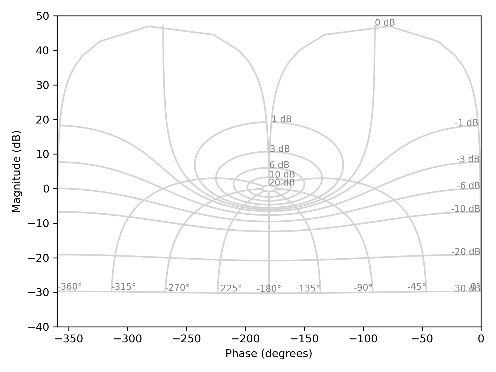
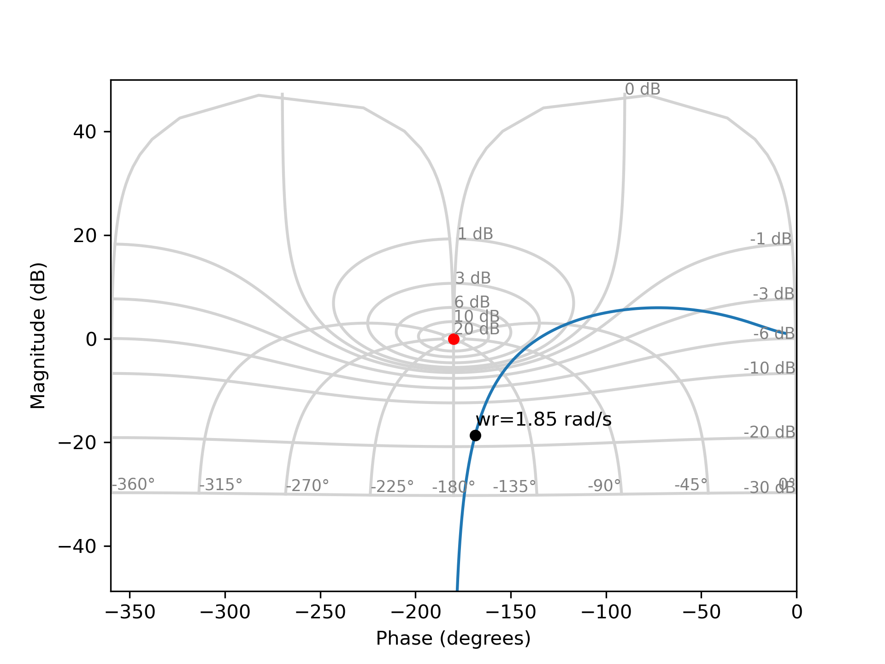
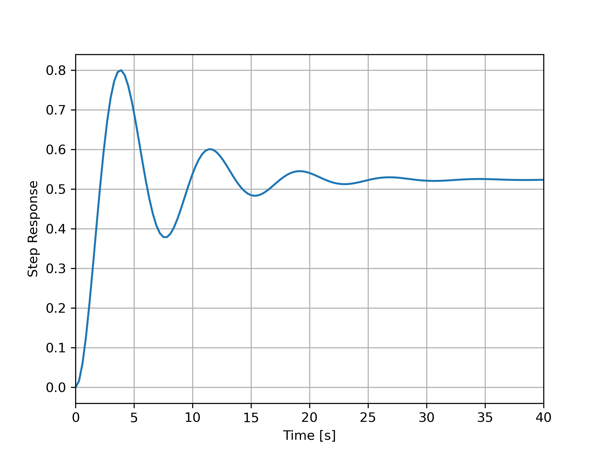

# Performances Dynamique des Systèmes Bouclés

Cette section s’intéresse aux performances dynamiques (temps de réponse, dépassement). Il présente l’utilisation de l’abaque de Black-Nichols pour estimer les caractéristiques d’un système bouclé à partir du lieu de Black de la boucle ouverte. En se basant sur une approximation par un système du second ordre, les grandeurs dynamiques (gain statique, pulsation propre, facteur d’amortissement) sont extraites et validées par comparaison avec les réponses temporelles.

## Objectif

Dans ce chapitre, nous montrons comment analyser les performances dynamiques d'un système en boucle fermée (temps de réponse, dépassement) à partir de son lieu de Black en boucle ouverte en utilisant une approximation second ordre.

## Abaque de Black-Nichols

L'abaque de Black-Nichols permet de déterminer graphiquement certaines caractéristiques de la fonction de transfert en boucle fermée $H(j\omega)$ à partir du lieu de Black de la boucle ouverte $G(j\omega)$. Cette abaque est composée de plusieurs contours.

* **Contours de gain**: le contour iso-gain nommé $x$ dB indique tous les points en boucle ouverte pour lesquelles le gain en boucle fermée est égal à $|H(j\omega)|_{dB}=x$ dB.

* **Contours de phase**: le contour iso-phasé nommé $y$ deg indique tous les points en boucle ouverte pour lesquelles la phase en boucle fermée est égale à $\arg[H(j\omega)]=y$ deg.

<figure>
    
    <figcaption>Abaque de Black-Nichols: Contours de gain</figcaption>
</figure>

## Approximation de la Dynamique

En utilisant les contours de gain et en approximant la dynamique du système en boucle fermée par celle d'un second ordre, il est possible d'obtenir rapidement les paramètres dynamique du systèmes en boucle fermée.

$$H(j\omega) \approx \frac{K}{\frac{1}{\omega_n^2}s^2+\frac{2\xi}{\omega_n}s+1}$$

### Principe

::: warning

Attention, la méthodologie décrite ci-dessous permet d'extraire les paramètres en boucle fermée à partir du lieu de Black en **boucle ouverte**.
:::

* Le gain statique en boucle fermée $G_0$ (dB) est donnée par le contour iso-gain qui tend vers le lieux de Black du système en boucle ouverte en basse-fréquence. En valeur naturelle, le gain statique en boucle fermée est alors donné par $K = 10^{G_0/20}$.

* Le gain maximum en boucle fermée $G_{M}$ (dB) est donnée par le contour iso-gain qui tangeante le lieux de Black du système en boucle ouverte. La pulsation associée correspond à la pulsation de résonance en boucle fermée $\omega_r$.
 
* La différence $M_{dB}=G_{M}-G_0$ (dB) correspond au facteur de résonance en boucle fermée. L'utilisation des abaques de second ordre permet ensuite de trouver le facteur d'amortissement en boucle fermée $\xi$ à partir de $M_{dB}$.

* La pulsation propre en boucle fermée s'obtient finalement à partir $\xi$ et $\omega_r$ via la relation 

$$\omega_n = \frac{\omega_r}{\sqrt{1-2\xi^2}}$$

### Exemple

<figure>
    
    <figcaption>Diagramme de Black Nichols</figcaption>
</figure>

La figure ci-dessus présente le lieu de transfert d'un système en boucle ouverte ainsi que les contours de gain. En appliquant la méthodologie, nous obtenons :

* un gain statique en BF égal à $G_0=-6$dB, soit $K=10^{-6/20}\approx 0.5$.
* un gain maximum en BF égal à $G_M=3$dB et une pulsation de résonance égale à $\omega_r=0.795$ rad/s.
* un facteur de résonance en BF égale à $M_{dB} = 3-(-6)=9$dB. En utilisant les abaques de second ordre, nous trouvons $\xi\approx 0.18$.
* une pulsation propre en BF égale à $\omega_n = \frac{0.795}{\sqrt{1-2\times 0.18^2}}=0.768$ rad/s.

#### Vérification

<figure>
    
    <figcaption>Réponse indicielle en boucle fermée (E=1)</figcaption>
</figure>

Pour vérifier nos résultat, la figure ci-dessus présente l'allure la réponse indicielle en boucle fermée ($E=1$). Nous observons que la valeur finale est proche du gain statique estimé $K=0.5$. De plus, le premier dépassement relatif est environ égal à $D_r(\%)=100\times (0.8-0.51)/0.51=56.86 \%$ ce qui correspond bien à un coefficient d'amortissement $\xi\approx 0.18$ (utilisation des abaques). Enfin la pseudo-période est proche de $T_p=8.5$s ce qui nous donne une pseudo-pulsation de $\omega_p=0.739$ rad/s. Nous obtenons alors une pulsation propre égale à $\omega_n = \frac{0.739}{\sqrt{1-0.18^2}}=0.751$ rad/s, ce qui est proche des résultats attendus.