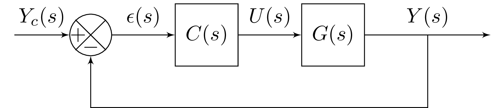

# Liste des correcteurs 

## Contexte

Pour corriger un système, une stratégie possible consiste à ajouter un correcteur dans la boucle ouverte.

<figure>
    
    <figcaption>Système bouclé intégrant un correcteur</figcaption>
</figure>

* $C(s)$: fonction de transfert du correcteur,
* $G(s)$: fonction de transfert du système non corrigé ou système à corriger,
* $H_{bo}(s)=C(s)G(s)$: fonction de transfert de la boucle ouverte,
* $H_{bf}(s)= H_{bo}(s) / (1+ H_{bo}(s))$: fonction de transfert de la boucle fermée.

Dans ce chapitre, nous allons considérer différents correcteurs usuels et introduire des techniques de réglage basées sur le lieu de Black (Nichols).

## Correcteur Proportionnel (P)

### Fonction de transfert

La fonction de transfert d'un correcteur proportionnel est donnée par :

$$C_p(s)=K_p$$

où $K_p>0$: désigne le gain (ou gain proportionnel).

#### Analyse harmonique 

* Gain : 

$$|G_p(j\omega)|_{dB} = 20 \log_{10}(K_p)$$

* Argument / Phase :

$$\arg[G_p(j\omega)] = 0$$

Le correcteur proportionnel impacte uniquement le gain et apporte un gain égal à $20 log_10(K_p)$. Par rapport au diagramme de Black, l'utilisation d'un gain $K_p$ va permettre de translater verticalement le lieu de transfert de la boucle ouverte $H_{bo}(s)=K_p G(s)$. Lorsque $K_p>1$, le lieu de transfert est translaté vers le haut ce qui permet d'améliorer la précision en boucle fermée. Lorsque $K_p<1$, le lieu de transfert est translaté vers le bas ce qui permet d'augmenter les marges de gain et de phase.

#### Technique de réglage 

Une technique possible consiste à choisir $K_p$ de sorte que le lieu de la boucle ouverte se positionne à une distance appropriée du point critique $(-180^\circ, 0 dB)$, pour garantir une stabilité suffisante en boucle fermée. 
dynamiques souhaitées. En pratique, on ajuste le gain jusqu’à obtenir des marges de stabilité satisfaisantes, typiquement une marge de phase supérieure à $45^\circ$ où une marge de gain de $6~\text{dB}$.

##### Exemple de réglage à partir de la marge de phase

Si l’on souhaite une marge de phase $\Phi_m \approx 45^\circ$, on commence par rechercher la pulsation (\omega_\varphi) telle que

$$\arg\big[G(j\omega_\varphi)\big] = -180^\circ + \Phi_m = -135^\circ.$$

À cette pulsation, on lit le module en dB : $|G(j\omega_\varphi)|_{dB}$. Pour que le gain de la boucle ouverte corrigée soit ramené à $0~\text{dB}$ à cette pulsation, on choisit alors :

$$ K_p = 10^{-\frac{|G(j\omega_\varphi)|_{dB}}{20}}$$ 

### Correcteur Proportionnel-Intégral (PI)

#### Fonction de transfert

La fonction de transfert d'un correcteur proportionnel-intégral est donnée par :

$$C_{pi}(s)=K_p + \frac{K_i}{s}$$

* $K_p$: gain proportionnel,
* $K_i$: gain intégral.

#### Diagramme de Bode

<figure>
    
    <figcaption>Diagramme de Bode d'un correcteur PI</figcaption>
</figure>

L'action intégrale du correcteur PI permet d'apporter du gain en basse-fréquence (diminution de l'erreur en régime permanent). Ce correcteur enlève néanmoins de la phase en basse-fréquence (diminution des marges de phase et de gain)

#### Avantages et inconvénients

**Avantages :**
- Élimine l'erreur statique pour une entrée en échelon (ajout d'un intégrateur dans la boucle ouverte)
- Simple à régler avec des méthodes comme Ziegler-Nichols.

**Inconvénients :**
- Peut ralentir la réponse transitoire (phénomène de dépassement ou d'oscillations).
- Peut déstabiliser le système en boucle fermée si les paramètres sont mal réglés.

### Correcteur Proportionnel-Dérivateur (PID)

#### Fonction de transfert

La fonction de transfert d'un correcteur proportionnel-intégral-dérivateur est donnée par :

$$C(s)=K_p + \frac{K_i}{s} + K_d s$$

* $K_p$: gain du correcteur proportionnel,
* $K_i$: gain de l'action intégrale.
* $K_i$: gain de l'action dérivée.

#### Diagramme de Bode

<figure>
    
    <figcaption>Diagramme de Bode d'un correcteur PID</figcaption>
</figure>

Lorsqu'il est bien réglé, un correcteur PID permet à la fois d'apporter du gain en basse-fréquence et d'ajouter de la phase en haute fréquence.

#### Avantages et inconvénients

**Avantages :**
- Combine les avantages des correcteurs P, I et D.
- Élimine l'erreur statique, améliore la stabilité et réduit les oscillations.
- Convient à une large gamme de systèmes.

**Inconvénients :**
- Plus complexe à régler (besoin de méthodes adaptées).
- Sensible au bruit (composante dérivée).

### Correcteur par Avance de Phase

#### Fonction de transfert

La fonction de transfert d'un correcteur à avance de phase est donnée par :

$$C(s)=K \frac{1+aTs}{1+Ts}$$

* $a> 1$: terme permettant d'ajouter de la phase,
* $K$: gain du correcteur,
* $T>0$: constante de temps du correcteur.

#### Diagramme de Bode

L’avance de phase maximale apportée par le correcteur est donnée par :

$$\varphi_{max} = \sin^{-1}\left(\frac{a-1}{a+1} \right)$$

et se produit à la pulsation 

$$\omega_{max} = \frac{1}{T\sqrt{a}}$$

::: details Demonstration : Propriétés du correcteur par avance de phase

En fréquentiel ($s = j\omega$), nous obtenons:
$$
C(j\omega) = K\,\frac{1 + j a T \omega}{1 + j T \omega}.$$

La phase apportée par le correcteur vaut :
$$
\varphi(\omega) = \arg\!\big(1 + j a T \omega\big) - \arg\!\big(1 + j T \omega\big)
= \arctan\!\big(a T \omega\big) - \arctan\!\big(T \omega\big).
$$

Pour rechercher $\varphi_{\max}$, nous allons annuler la dérivée de $\varphi(\omega)$ par rapport à $\omega$. Nous trouvons
$$
\left.\frac{d\varphi}{d\omega}\right|_{\omega=\omega_{max}}=0 \Rightarrow
\frac{aT}{1+(aT\omega_{max})^2} - \frac{T}{1+(T\omega_{max})^2} = 0.
$$

Il en vient que :
$$
a-1 = a(a-1)(T\omega_{max})^2\Rightarrow (T\omega_{max})^2 = \frac{1}{a}
$$ 
Finalement, la phase est maximale pour 
$$
\omega_{max} = \frac{1}{T\sqrt{a}}
$$
Pour cette valeur, la phase est égale à :

$$\varphi_{\max} = \arctan(\sqrt{a}) - \arctan\!\Big(\frac{1}{\sqrt{a}}\Big).$$

En utilisant les propriétés de la fonction $\arctan$, il est possible d'écrire cette expression sous forme plus compacte :

$$ \varphi_{\max} = \arcsin\!\left(\frac{a-1}{a+1}\right)$$

:::

<figure>
    
    <figcaption>Diagramme de Bode d'un correcteur par avance de phase</figcaption>
</figure>
