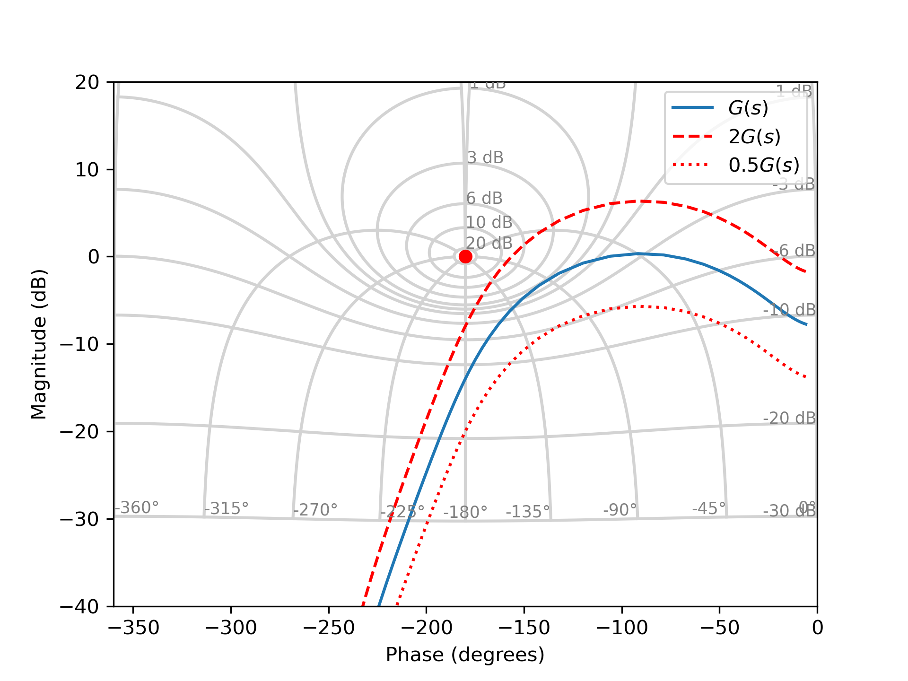
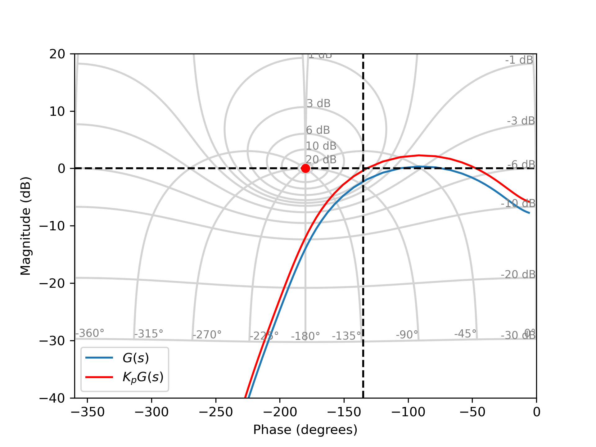

# Correcteur Proportionnel (P)

## Fonction de transfert

La fonction de transfert d'un correcteur proportionnel est donnée par :

$$C_p(s)=K_p$$

où $K_p>0$: désigne le gain (ou gain proportionnel).

### Analyse harmonique 

* Gain : 

$$|G_p(j\omega)|_{dB} = 20 \log_{10}(K_p)$$

* Argument / Phase :

$$\arg[G_p(j\omega)] = 0$$

Le correcteur proportionnel impacte uniquement le gain et apporte un gain égal à $20 log_{10}(K_p)$. Par rapport au diagramme de Black, l'utilisation d'un gain $K_p$ va permettre de translater verticalement le lieu de transfert de la boucle ouverte $H_{bo}(s)=K_p G(s)$. Lorsque $K_p>1$, le lieu de transfert est translaté vers le haut ce qui permet d'améliorer la précision en boucle fermée. Lorsque $K_p<1$, le lieu de transfert est translaté vers le bas ce qui permet d'augmenter les marges de gain et de phase.

<figure>
    
    <figcaption>Influence du correcteur sur la fonction de transfert en boucle ouverte.</figcaption>
</figure>

## Technique de réglage 

Une technique possible consiste à choisir $K_p$ de sorte que le lieu de la boucle ouverte se positionne à une distance appropriée du point critique $(-180^\circ, 0 dB)$, pour garantir une stabilité suffisante en boucle fermée. dynamiques souhaitées. En pratique, on ajuste le gain jusqu’à obtenir des marges de stabilité satisfaisantes, typiquement une marge de phase supérieure à $45^\circ$ ou une marge de gain de $6~\text{dB}$.

### Exemple de réglage à partir de la marge de phase

Si l’on souhaite une marge de phase $\Phi_m \approx 45^\circ$, on commence par rechercher la pulsation $\omega_\varphi$ telle que

$$\arg\big[G(j\omega_\varphi)\big] = -180^\circ + \Phi_m = -135^\circ.$$

À cette pulsation, on lit le module en dB : $|G(j\omega_\varphi)|_{dB}$. Pour que le gain de la boucle ouverte corrigée soit ramené à $0~\text{dB}$ à cette pulsation, on choisit alors :

$$ K_p = 10^{-\frac{|G(j\omega_\varphi)|_{dB}}{20}}$$ 

A titre d'illustration, la figure suivante présente le lieu de transfert du système en boucle ouverte avant et après utilisation du correcteur proportionnel.

<figure>
    
    <figcaption>Réglage du correcteur pour obtenir une marge de phase de 45 degrés.</figcaption>
</figure>