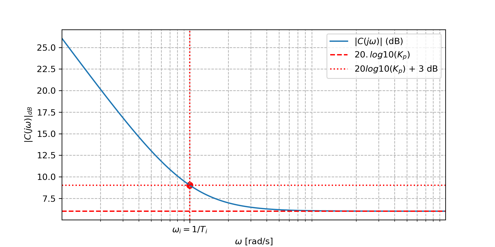
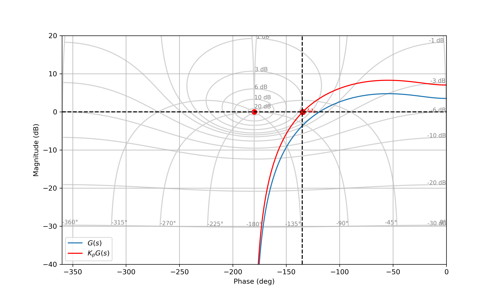

# Correcteur Proportionnel-Intégral (PI)

## Fonction de transfert

La fonction de transfert d'un correcteur proportionnel intégral peut s'exprimer sous plusieurs formes :

* Forme parallèle :

$$C_{pi}(s)=K_p + \frac{K_i}{s}$$

où $K_p>0$ correspond au gain proportionnel et $K_i>0$ désigne le gain intégral.

* Forme série :

$$C_{pi}(s)=K_p\left(1+ \frac{\omega_i}{s}\right) = K_p\left(1+ \frac{1}{T_i s}\right)$$

où $\omega_i=K_i/K_p$ correspond à la pulsation caractéristique du PI et $T_i = K_p/K_i$ correspond au temps caractéristique. 

### Expression des pôles et zéros 

La fonction de transfert peut s'exprimer sous la forme factorisée suivante :

$$C_{pi}(s)= K_p\left(\frac{s+\omega_i}{s}\right)$$

Cette fonction de transfert possède :

* un zéro en $s=-\omega_i$,
* un pôle en $s=0$.

L'ajout d'un pôle en $s=0$ permet de faire en sorte que la fonction de transfert en boucle ouverte $H_{bo}(s)=C(s)G(s)$ soit de type $1$ (système précis).

### Analyse harmonique 

* Gain : 

$$|G_{pi}(j\omega)|_{dB} = 20 \log_{10}(K_p) + 10 \log_{10}\left(1+\left(\frac{\omega_i}{\omega}\right)^2\right)$$

* Argument / Phase ($K_p>0$):

$$\arg[G_{pi}(j\omega)] = \arctan\left(\frac{\omega}{\omega_i}\right) - 90^o$$

 Notons que la réponse fréquentielle possède un point particulier en $\omega=\omega_i$. En effet, $G_{pi}(j\omega_i)=K_p(1-j)$ et donc $|G_{pi}(j\omega_i)|=K_p\sqrt{2}$ et $\arg[G_{pi}(j\omega_i)] = - 45^\circ$.

#### Illustration 

<figure>
    
    <figcaption>Gain du correcteur PI.</figcaption>
</figure>

<figure>
    
    <figcaption>Phase du correcteur PI.</figcaption>
</figure>

Le correcteur PI apporte un gain infini en basse-fréquence. Cette propriété permet à la fonction de transfert en boucle ouverte $H_{bo}(s)=C(s)G(s)$ de se confondre avec le contour $0$ dB en basse-fréquence, ce qui améliore la précision en boucle fermée. Le correcteur PI retranche de la phase en basse-fréquence. Cette propriété reduit les marges de gain et de phase.

## Technique de réglage 

Il existe différentes techniques de réglage possible pour le correcteur PI. Un bon réglage doit permettre d'apporter de la précision tout en maintenant des marges de gain et de phase acceptable. Pour régler les paramètres du correcteur consiste à régler successivement le paramètre $K_p$, puis $\omega_i$ (et donc $K_i$). 

### Réglage du gain proportionnel

Le réglage du gain $K_p$ s'obtient en négligeant la partie intégrale du correcteur. Une approche possible consiste à fixer $K_p$ de sorte à imposer pour le système $K_pG(s)$:

* une marge de phase $M_{\varphi}$ (typiquement $45^\circ$)
* où une marge de gain $M_{G}$ (typiquement $6$ dB).

À la fin de cette étape, on détermine la pulsation de coupure $\omega_c$, définie par :

$$ |K_pG(j\omega_c)|_{dB}=0~\text{dB}. $$

<figure>
    
    <figcaption>Réglage du gain proportionnel.</figcaption>
</figure>

### Réglage du gain intégral

Pour régler le gain intégral, une approche possible consiste à imposer que son action ne perturbe pas les marges de stabilité. Pour respecter cette contrainte, il est nécessaire que $\omega_c$ se situe dans la zone où le correcteur se comporte principalement comme un gain proportionnel, c-à-d que $\omega_c \gg \omega_i$. En pratique, une valeur couramment utilisée est :

$$\omega_i = \frac{\omega_c}{10}$$

Notons que l'utilisation d'une valeur de $\omega_i$ tend à ralentir significativement le système en boucle fermée.

<figure>
    
    <figcaption>Réglage du gain intégral.</figcaption>
</figure>

Notons que l'introduction du gain intégral peut perturber légèrement la pulsation de coupure. Dans ce contexte, il peut être intéressant de modifier le gain proportionnel à posteriori.