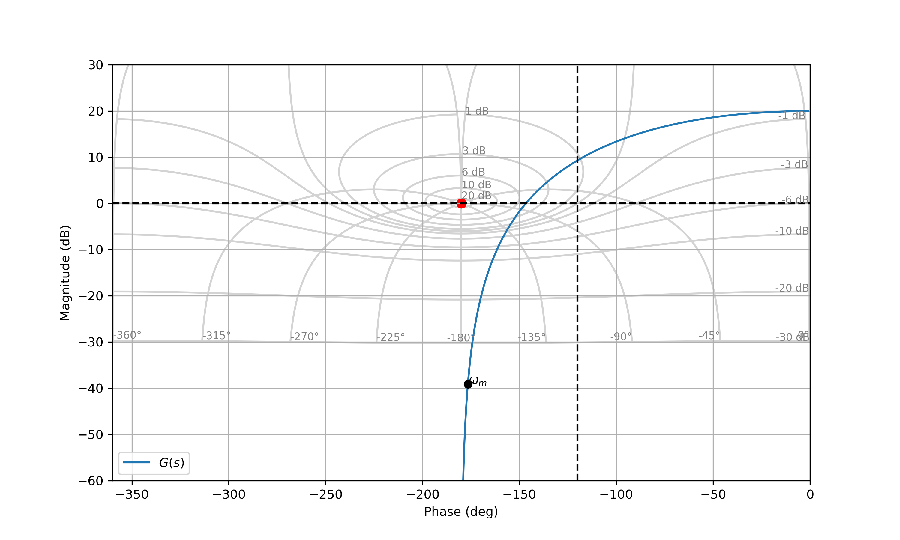
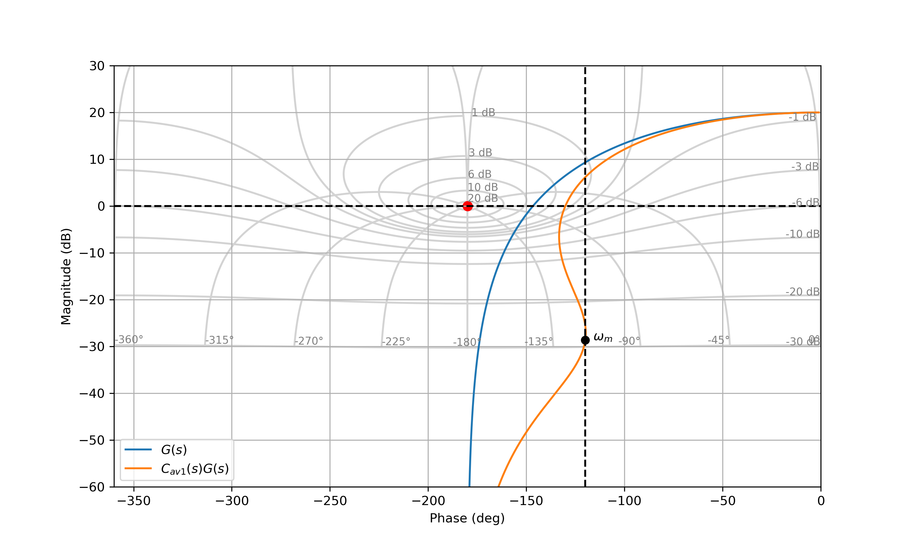

# Correcteur à Avance de Phase (AP)

## Fonction de transfert

La fonction de transfert d'un correcteur à avance de phase peut s'exprimer sous plusieurs formes :

$$C_{av}(s)=K \left(\frac{1+T s}{1+aT s}\right)$$

où $K>0$ correspond au gain, $T$ est le temps caractéristique du correcteur, et $0<a<1$ est un paramètre de liberté.

### Expression des pôles et zéros 

La fonction de transfert possède :

* un zéro en $s=-\frac{1}{T}$,
* un pôle en $s=-\frac{1}{aT}$.

### Analyse harmonique 

La réponse harmonique s'exprime sous la forme :

$$C_{av}(j\omega )=K\left(\frac{1+jT\omega }{1+jaT \omega}\right)$$

* Gain : 

$$|G_{av}(j\omega)|_{dB} = 20 \log_{10}(K) + 10 \log_{10}\left(1+T^2\omega^2\right) - 10 \log_{10}\left(1+a^2 T^2\omega^2\right)$$

* Argument / Phase ($K>0$):

$$\arg[G_{av}(j\omega)] = \arctan\left(T\omega\right) - \arctan\left(aT\omega\right)$$

#### Maximisation de l'apport de phase

Il est possible de démontrer que la phase présente un maximum 

$$\max_{\omega} \arg[G_{av}(j\omega)]$$

à la pulsation 

$$\omega_m = \frac{1}{T\sqrt{a}}$$

A cette pulsation, le gain et la phase sont respectivement donnés par :

- Gain :

$$|G_{av}(j\omega_m)| = \frac{K}{\sqrt{a}}$$

- Phase (en radian):

$$\boldsymbol\Phi_m = \arg[G_{av}(j\omega_m)] = \text{asin}\left(\frac{1-a}{1+a}\right)$$

#### Illustration 

<figure>
    
    <figcaption>Gain du correcteur AP.</figcaption>
</figure>

<figure>
    
    <figcaption>Phase du correcteur AP.</figcaption>
</figure>

Le correcteur AP permet d'ajouter de la phase, surtout aux moyennes fréquences. Il permet de gagner en stabilité. Le correcteur AP permet de s'affranchir des dilemmes stabilité / rapidité 

## Technique de réglage 

Pour régler les 3 paramètres du correcteur, une technique possible consiste à imposer:

- la marge de phase $M_{\varphi}$ souhaitée, 
- la pulsation de coupure à $0$dB, $\omega_c$ souhaitée.
- un incrément de phase maximum à la pulsation de coupure à $0$ dB.

### Réglage de l'apport de phase (paramètres $a$ et $T$)

- On impose $\omega_m = \omega_c$ rad/s où $\omega_c$ correspond à la pulsation de coupure à $0$dB souhaitée.
- On mesure $\varphi_m=\arg[G(j\omega_m)]$ la phase mesurée à la pulsation $\omega_m$.
- On calcule l'incrément de phase nécessaire $\boldsymbol \Phi_m$ permettant d'atteindre la marge de phase souhaitée c-à-d $-180 + M_{\varphi} = \varphi_m + \boldsymbol \Phi_m$. Nous obtenons :
 
$$\boldsymbol \Phi_m = M_{\varphi} - 180 -  \varphi_m$$

- On fixe **le paramètre $a$** de manière à fixer l'incrément de phase souhaité : 

$$a = \frac{1-\sin( \boldsymbol \Phi_m)}{1+\sin( \boldsymbol \Phi_m)}$$

où $\boldsymbol \Phi_m$ s'exprime en radian.

- On fixe **le paramètre $T$** pour obtenir l'incrément de phase souhaitée à la pulsation $\omega_m$:

$$T = \frac{1}{\omega_m \sqrt{a}}$$

### Réglage du gain (paramètre $K$)

- On trace le lieu en boucle ouverte du système corrigé $H_{bo1}=C_{av1}(s)G(s)$ où $C_{av1}(s)$ désigne la fonction de transfert du correcteur par avance de phase lorsque $K=1$,
- On évalue le gain en dB à la pulsation $\omega_m$, c-à-d $G_{dB}=|H_{bo1}(j\omega_m)|_{dB}$.
- On fixe le **paramètre $K$** avec $K=10^{-G_{dB}/20}$ pour obtenir un gain de $0$ dB à la pulsation $\omega_m$.

## Exemple de réglage

Les figures suivantes montrent comment régler un correcteur par avance de phase pour obtenir une pulsation de coupure à $0$ dB égale à $\omega_c = 30$ rad/s et une marge de phase $M_{\varphi} = 60$ deg.

<figure>
    
    <figcaption>Lieu de transfert en boucle ouverte.</figcaption>
</figure>

<figure>
    
    <figcaption>Lieu de transfert corrigé en boucle ouverte avec K=1.</figcaption>
</figure>

<figure>
    
    <figcaption>Lieu de transfert corrigé en boucle ouverte.</figcaption>
</figure>

La figure suivante présente l'allure de la réponse indicielle en boucle fermée après correction du système.

<figure>
    
    <figcaption>Réponse indicielle en boucle fermée.</figcaption>
</figure>
